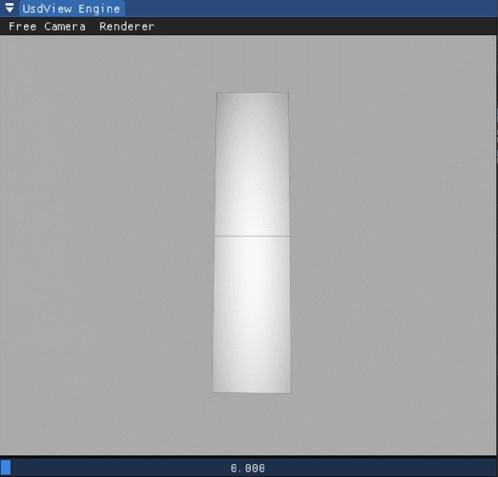
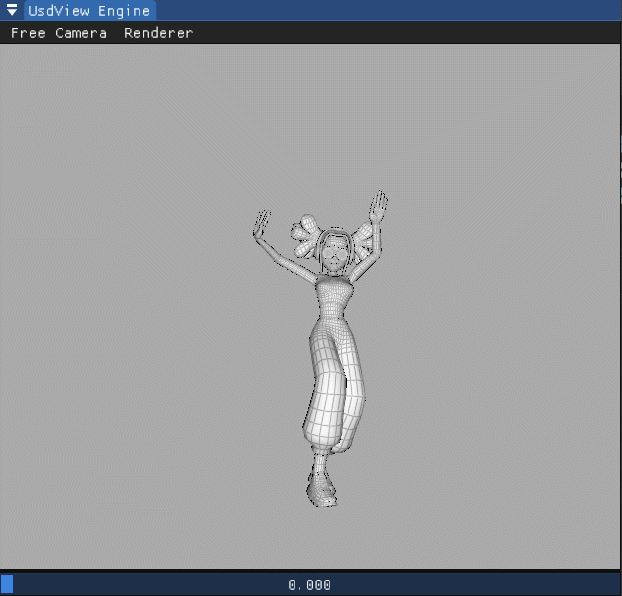
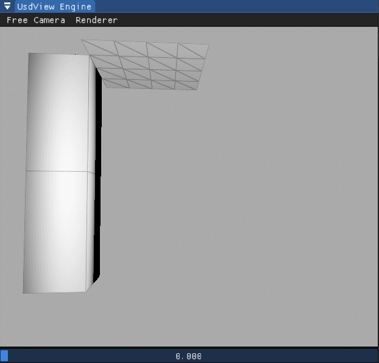
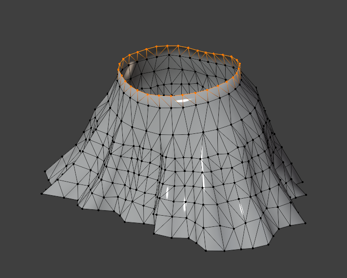
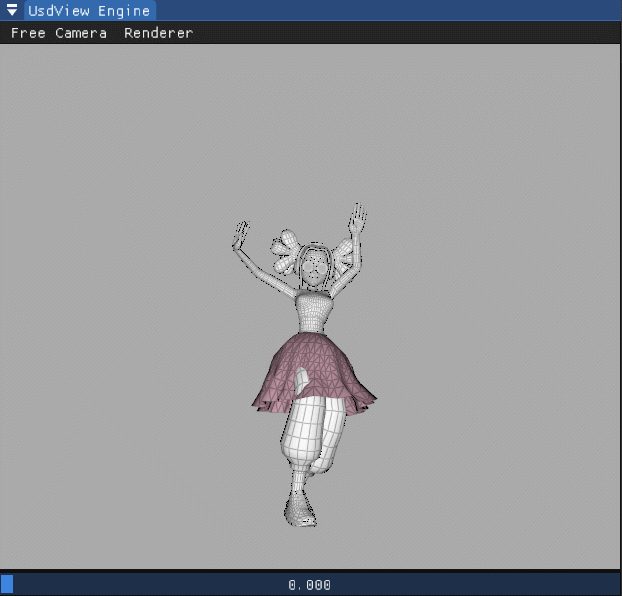

#  Homework 10 Character Animation 角色动画

###### 85 夏子汐 PB22000057

## 一、基本方法

动画由关节的活动组成，记录每一帧的关节相对位置（通过矩阵`localTransform`记录），可以构建出关节的运动。

将关节运动进行“蒙皮”，可以获得逼真的角色动画。皮Mesh的每一个顶点的位置和运动需要由关节位置确定，可以视作关节位置的线性组合，通过``jointWeight`和`jointIndices`记录。

如果对角色加上裙子等布料，布料的运动可以通过物理仿真（Hw8）给出，需要进行碰撞判断和处理。

## 二、角色动画

1. 计算全局空间的关节位置`worldTransform`的时候需要在父节点计算完成后再计算子节点的（直接复合即可），需要进行BFS或者DFS操作：

	```c++
	// ----------- (HW_TODO) Traverse all joint and compute its world space transform ---
	std::queue<std::shared_ptr<Joint>> q;
	q.push(get_root());
	get_root()->compute_world_transform();
	while (!q.empty()) {
	    auto x = q.front();
	    q.pop();
	    for (auto& c : x->children_) {
	        c->compute_world_transform();
	        q.push(c);
	    }
	}
	```

2. 三维和四维矢量的变换：方法`Matrix4d::TransformAffine(Vector3d)`表示把三维矢量加上一个1变成四维，并且与`this`（4x4矩阵）相乘得到一个四维矢量，**同时换回三维向量**，所以公式$\widetilde{\mathbf{x}} = \sum_i^n w_i \mathbf{T}_i \mathbf{B}_i^{-1} \widetilde{\mathbf{x}}^0$的一项计算写成下面的形式：

	```c++
	x += weight[j] * joint->get_world_transform().TransformAffine(
	         ((joint->get_bind_transform().GetInverse()).TransformAffine(vertices[i])));
	```

3. 得到的效果如下：

| `arm.usda`         | `belly_dance_girl.usda` |
| ------------------ | ----------------------- |
|  |       |

## 三、角色上面的布料模拟

### 3.1 基本问题和方法

1. 与之前的物理仿真不同的地方在于动画中物体的固定点是可以发生运动的，那么如何保持固定？可以强制更新坐标处理。（基于半隐式积分方法）例如下面的范例：

	> 根据助教Hw8的文档，对于隐式积分方法，不能这样操作，因为没有考虑这些约束对方程求解起到的作用。以下均为基于半隐式方法得到的结果，时间步长`dt=0.01`，没有发生爆炸。

	

2. 如何处理碰撞？抽象成一个球，可以通过“惩罚力”方法求解；我在Hw8中给出了“将靠近速度和力设置为0”的方法同样可以适用于半隐式方法，本作业将同时使用两种方法。

### 3.2 效果展示和讨论

带有碰撞的效果如下：


对具体实现细节讨论如下：

1. 为了简便和效率处理，只考虑将人体抽象成一个球的碰撞问题（注：本架构经过一些处理和拓展原则上可以处理多个球的碰撞），那么如何选取这个球的大小和半径呢？

	文档中的图（如下）给出了确定这个球的（几乎）唯一的信息。可以先求出中心点，但是以此为球心，差不多固定点半径大小构建，显然不能达到目的；需要向下一段距离，构建一个更大的球。这需要：

	- 找到“平面”的法向：可以通过中心点到各个顶点的矢量叉乘得到；
	- 找到度量长度的量：这里选取到中心点的最近距离作为度量；
	- 从中心点沿法向向下行进度量的一定倍数作为球心；
	- 确定球的半径：球的半径不超过球心到固定点的距离最小值，可以以这个值作为度量。
	
	综上，有两个可调参数，即球心到平面中心点距离的度量倍数和球半径的度量倍数。本例子两个量分别为4和0.8。

	

2. 通过上面的选取方法可以明显看出问题：没有考虑粗大的裤子的运动，导致如果女孩腿向前或者张开/蹲下，容易出现穿模现象；而且由于粗糙的抽象和尽可能的避免穿模，导致裙子“鼓出来”了一个球体的形态，不符合物理现实。

3. 为了确定法向朝向z轴某个方向（本例子中是正向），需要进行特判（尽管大多数情况下叉乘的结果在z方向大致相同）：

	```c++
	auto ans = p.cross(q);
	if (ans[2] < 0)
	    ans = -ans;
	normal += ans;
	```

4. 如果考虑布料自碰撞，效果如下，与上图相比布料交叉现象没有什么变化（应该可以由黑色块的出现表征），一种可能是固定点的运动可以导致皱褶，再粗糙的Mesh近似下就变成了交叉：

  

