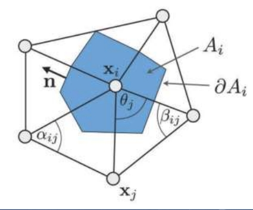
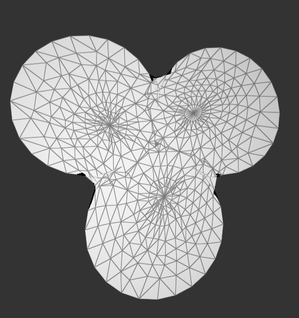
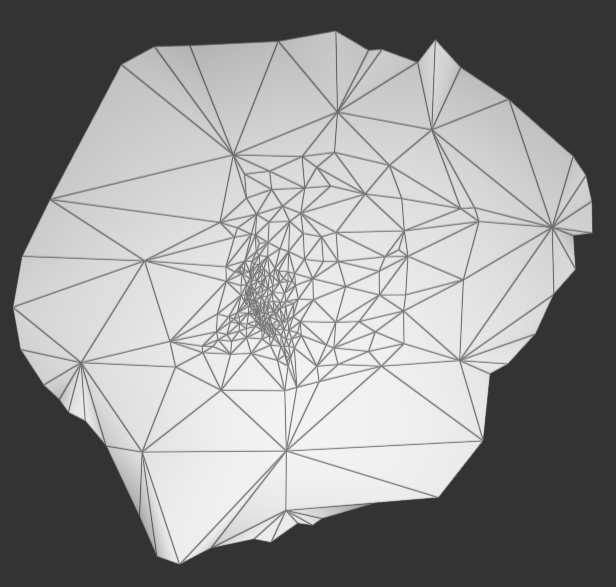

# Homework 4 Tutte Parametrization
###### 85 夏子汐 PB22000057

###### 提示：内含.gif文件，建议直接打开"实验报告.md"查看。

## 一、算法描述

### 极小曲面

极小曲面是指平均曲率处处为零的曲面，例如马鞍面。

离散化描述为点的微分坐标$$ \boldsymbol\delta _ i = \boldsymbol{v _ i} - \sum _ {j \in N(i)} w _ j \boldsymbol{v _ j},$$为零（其中N(i)为点i的邻接点），这给出了一系列方程组。

如果施加**硬约束**，要求边界处的点不变，那么方程可以表示为$$Av=b$$其中对于非边界点，$A$对应行元素为$-w_j$和$1$（对角线上），$b$对应行元素为$0$；对于边界点，$A$对应行元素为$1$（对角线上），$b$对应行元素为$\boldsymbol{v _ i}$（硬约束保证不变）。

所以这个矩阵$A$并不是对称矩阵，可以使用稀疏矩阵的LU方法求解。

$w_j$有不同的选取方法，如下（以下均没有归一化，实际操作时需要根据$\sum _ {j \in N(i)} w _ j=1$归一化）：

1. Uniform Weights：$w_j=1$；

2. Cotangent Weights：如图，$w _ j = \cot \alpha _ {ij} + \cot \beta _ {ij}$，这样可以保留原网格的几何特征；

	

3. Floater's shape-preserving weights：如图所示，对于某一个点，平均曲率不为零造成了（左图）该点的各个夹角之和不等于$2\pi$。取测地坐标，把这个小区域展开成平面，要求：  

	- 该点向外连接的每一条边长度不变；
	- 各个夹角比例不变，总和变为$2\pi$。
	
	得到了（中图）的平面化的网格。接着对于每一个边$p\to p_l$（右图），寻找一条与直线$pp_l$相交（包括一边的交点，以确保唯一）的紧邻邻居连边$p_{r(l)}\to p_{r(l)+1}$，记对系数$w_j$贡献为
    $$\Delta(w_l)=\cfrac{S_{\Delta pp_{r(l)}p_{r(l)+1}}}{S_{\Delta p_lp_{r(l)}p_{r(l)+1}}}$$    $$\Delta(w_{r(l)})=\cfrac{S_{\Delta p_lpp_{r(l)+1}}}{S_{\Delta p_lp_{r(l)}p_{r(l)+1}}}$$    $$\Delta(w_{r(l)+1})=\cfrac{S_{\Delta p_lp_{r(l)}p}}{S_{\Delta p_lp_{r(l)}p_{r(l)+1}}}$$
    对所有$l$求和，可以得到所有系数$w_j$，由于上面三个数的和为$1$，所以求和后系数和为$N$（连边数量），归一化需要除以$N$。
	
	
### 曲面参数化
#### 把边界映射到$[0,1]\times[0,1]$域内
寻找边界，把边界映射到$[0,1]\times[0,1]$平面区域的边界上（保持长度不变），或者映射到这个区域最大的圆周上（保持长度不变，也可以变成保持角度比例不变）。
#### 获得$[0,1]\times[0,1]$上的极小曲面
上述三种方法均可以获得极小曲面（显然极小曲面一定是一个平面，且在区域内），但是要注意**系数的选取是按照边界映射前的网格确定的**。
#### 获取并应用纹理坐标
纹理坐标是指网格中某点对应一个2D图片上的一个点，这样可以通过这个图片给3D网格上色（插值方法）。当图片映射到$[0,1]\times[0,1]$区域时，可以直接把点的坐标对应图片的坐标（也是在这个范围内的），然后再把这个极小曲面复原，就可以得到原图的纹理坐标，实现上色。

## 二、实现效果展示
### 极小曲面

|                   | Uniform weights        | Cotangent weights      | Shape-preserving weights |
| ----------------- | ---------------------- | ---------------------- | ------------------------ |
| Balls             |  |  |    |
| Bunny Head        |  |  |    |
| Cat Head          |  |  |    |
| David328          |  |  |    |
| David328 （细节） |  |  |    |
| Nefertiti Face    |  |  |    |

节点编程如图所示，其中插入“Transform Geometry”块，是为了更改连线更加方便。文件为`Blueprints1.json`。

代码中的亮点：

1. 三种不同的方法均需要输入"Original Geometry"（要求必须与Input的图形结构（除坐标外）完全相同），因为计算系数是由Original Geometry给出（Uniform Weights除外，但是为了结构工整还是加了这个接口）

2. 某一个点的连边集合`vertex_handle.outgoing_halfedges()`没有`size()`方法可以获得其大小，但是可以通过如下两种代码之一获得大小：

	~~~c++
	// count_if(function f)：计算f为true的元素个数。
	auto num=vertex_handle.outgoing_halfedges().count_if({return true;});
	// sum(function f)：计算所有元素的f函数结果之和。
	auto num=vertex_handle.outgoing_halfedges().sum({return 1;});
	~~~

3. 将三种方法放在一个`node_min_surf.cpp`里面，在函数`node_register`里面进行三次操作。

### 边界映射和曲面参数化

映射边界，并且进行极小曲面处理后可以进行参数化，这里以`Balls.usda`为例。

|                        | Uniform weights        | Cotangent weights      | Shape-preserving weights |
| ---------------------- | ---------------------- | ---------------------- | ------------------------ |
| map boundary to circle |  |  |    |
| map boundary to square |  |  |    |

节点编程如图所示，文件为`Blueprints2.json`：

其中`Map Boundary to Square(strict)`针对某些映射到正方形无法覆盖四角的情况强制覆盖。

### 利用参数化曲面给原图上色

节点编程如图所示，文件为`Blueprints3.json`：

增加了若干节点，其中：

1. `Set Texture Coord`：把每个点的(x,y)坐标直接设置为纹理坐标，原则上要求在$[0,1]\times[0,1]$上，如果超出范围，实际上会按照周期性重复铺满整个纹理坐标平面。
2. `Set Texture Coord from [0,1]x[0,1] Mesh`：从参数化结果的纹理坐标直接应用于原图，要求两个输入的图片结构相同。
3. `Mesh Add Texture`：将图片应用在带有纹理坐标的网格上。

其中`Set Texture Coord`和`Set Texture Coord from [0,1]x[0,1] Mesh`加起来等价于如下命令：

效果如下：

|        | Uniform weights        | Cotangent weights      | Shape-preserving weights |
| ------ | ---------------------- | ---------------------- | ------------------------ |
| Circle |  |  |    |
| Square |  |  |    |

可以明显看到Cotangent Weight保角的特性，图块边缘保证了局部保证正交。

## 三、总结

1. 我刚开始用了很长时间理解框架和OpenMesh内容，感觉理解代码能力有待提升；
2. 从结果来看"Shape-preserving weights"方法效果并不理想，应该是代码有一点问题；
3. 节点编程结构虽然较大增加了框架代码量，但是实现了一种类似“解释运行”的方法，不用重复编译就可以实现复杂逻辑处理，当然代价是框架代码编译时间过长，本机上大概要10分钟。