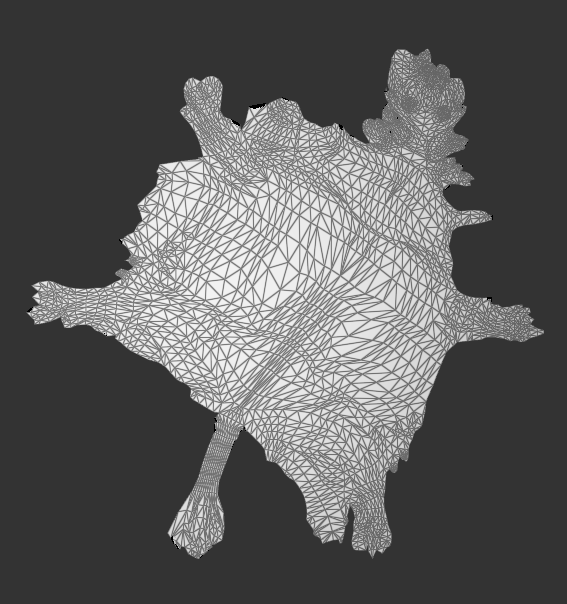
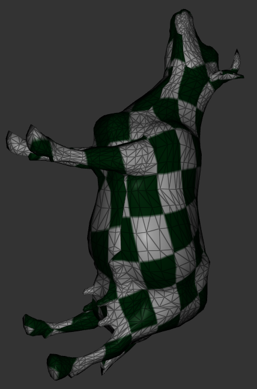

# HomeWork 5 ARAP&ASAP Parameterization

###### 85 夏子汐 PB22000057

## 一、算法原理

### Local/Global Approach

为了将三维网格二维参数化，且能够尽可能保持形状不变，如图，需要先把每一个片映射到平面上（改变形状和大小），然后就可以假设某一个片$t$从这个平面（中间图片，点的坐标记为$x_t^i$）映射到二维网格（右边图片，点的坐标记为$u^i$）上面，可以记为
$$
(u^i-u^j)=L_t(x_t^i-x_t^j)
$$
其中$i,j$为网络点的编号，要求两个点都在面$t$上面。使用的是面片上点坐标的差，是因为变化可能会有平移项。


为了尽可能小的形变，要求线性算符（变换）$L_t$为$2\times2$相似矩阵，这提出了更多的要求。考虑到两个要求不可能同时成立，所以需要进行**软约束**，就是通过最小化能量来尽可能满足上述要求。能量为：
$$
E(u,L)=\cfrac12\sum_t\sum_i\cot(\theta_t^i)||(u^i-u^{i+1})-L_t(x_t^i-x_t^{i+1})||^2
$$
加权$\cot(\theta_t^i)$是面元中与$(i,i+1)$边相对的角的余切值。

### As-rigid-as-possible (ARAP)

ARAP要求$L_t$为旋转变换，即$L_t=\begin{pmatrix}a&b\\-b&a\end{pmatrix}$，且$a^2+b^2=1$。

能量对$u^i$求偏导，得：
$$
0=\cfrac{\partial E}{\partial u^i}=\sum_{j\in N(i)}[\cot(\theta_{ij})[(u^i-u^j)-L_{t(i,j)}(x^i-x^j)]-\cot(\theta_{ji})[(u^j-u^i)-L_{t(j,i)}(x^j-x^i)]]
$$
化简得
$$
\sum_{j\in N(i)}[(\cot(\theta_{ij})+\cot(\theta_{ji}))(u^i-u^j)=\sum_{j\in N(i)}[\cot(\theta_{ij})L_{t(i,j)}+\cot(\theta_{ji})L_{t(j,i)}](x^i-x^j)
\tag{1}
$$

对任意$i$成立。其中$\cot(\theta_{ij})$表示$i\to j$这一个半边对应面上的对角余切；$L_{t(i,j)}$表示$i\to j$这一个半边对应的线性变换。

由于对变换$L_t$的要求不是线性的，不能直接解方程求解，需要使用非线性的逼近方法：

1. 对于某个已知的2D网格（初始网格可以由Tutte Parameterization得到），通过点的坐标求解$L_t$；

	根据论文，求解$L_t$的方法如下：

	- 对于每一个面得到"cross-covariance" matrix$S_t(u)$来替代Jacobi式：
		$$
		S_t(u)=\sum_i\cot(\theta_t^i)(u^i-u^{i+1})(x^i-x^{i+1})^T
		$$

	- 对$S_t(u)$进行SVD分解：$S_t(u)=U\Sigma V^T$，其中$\Sigma=\begin{pmatrix}\sigma_1&0\\0&\sigma_2\end{pmatrix}$，$U$、$V$是酉矩阵；

	- 得到旋转变换$L_t=UV^T$。

2. 求解得到的$L_t$可以当作已知条件，代入(1)式求解$u^i$，方程(1)为线性的，可以记作$Au=b$；

3. 反复迭代得到逼近解。

### As-similar-as-possible (ASAP)

ASAP要求线性变换$L_t$为相似的，可记为$L_t=\begin{pmatrix}a_t&b_t\\-b_t&a_t\end{pmatrix}$，能量
$$
E(u,L)=\cfrac12\sum_t\sum_{i=0}^2\cot(\theta_t^i)||(u^i-u^{i+1})-\begin{pmatrix}a_t&b_t\\-b_t&a_t\end{pmatrix}(x_t^i-x_t^{i+1})||^2
\tag{2}
$$

1. 对$u^i$求偏导，结果同ARAP，为
	$$
	\sum_{j\in N(i)}[(\cot(\theta_{ij})+\cot(\theta_{ji}))(u^i-u^j)=\sum_{j\in N(i)}[\cot(\theta_{ij})L_{t(i,j)}+\cot(\theta_{ji})L_{t(j,i)}](x^i-x^j)
	$$
	分量式子即
	$$
	\begin{aligned}
	&[\sum_{j\in N(i)}(\cot(\theta_{ij})+\cot(\theta_{ji})]{u^i}_0\\
	+&\sum_{j\in N(i)}[-(\cot(\theta_{ij})+\cot(\theta_{ji}))]{u^j}_0\\
	+&\sum_{j\in N(i)}[-\cot(\theta_{ij})({x^i}_0-{x^j}_0)]a_{t(i,j)}+\sum_{j\in N(i)}[-\cot(\theta_{ij})({x^i}_1-{x^j}_1)]b_{t(i,j)}\\
	+&\sum_{j\in N(i)}[-\cot(\theta_{ji})({x^i}_0-{x^j}_0)]a_{t(j,i)}+\sum_{j\in N(i)}[-\cot(\theta_{ji})({x^i}_1-{x^j}_1)]b_{t(j,i)}\\
	=&0
	\end{aligned}
	\tag{3.1}
	$$
	和
	$$
	\begin{aligned}
	&[\sum_{j\in N(i)}(\cot(\theta_{ij})+\cot(\theta_{ji})]{u^i}_1\\
	+&\sum_{j\in N(i)}[-(\cot(\theta_{ij})+\cot(\theta_{ji}))]{u^j}_1\\
	+&\sum_{j\in N(i)}[-\cot(\theta_{ij})({x^i}_1-{x^j}_1)]a_{t(i,j)}+\sum_{j\in N(i)}[\cot(\theta_{ij})({x^i}_0-{x^j}_0)]b_{t(i,j)}\\
	+&\sum_{j\in N(i)}[-\cot(\theta_{ji})({x^i}_1-{x^j}_1)]a_{t(j,i)}+\sum_{j\in N(i)}[\cot(\theta_{ji})({x^i}_0-{x^j}_0)]b_{t(j,i)}\\
	=&0
	\end{aligned}
	\tag{3.2}
	$$
	
	
	注意到这个式子其实有两个分量满足同个形式的式子，而下面的关于$a,b$导数就没有这种性质。
	
2. 对$a_t$求导，结果为
	$$
	\begin{aligned}
	0=\cfrac{\partial E}{\partial a_t}=&-\sum_{i=0}^2\cot(\theta_t^i)({x_t^i}_0-{x_t^{i+1}}_0)[({u^i}_0-{u^{i+1}}_0)-a_t({x_t^i}_0-{x_t^{i+1}}_0)-b_t({x_t^i}_1-{x_t^{i+1}}_1)]\\
	&-\sum_{i=0}^2\cot(\theta_t^i)({x_t^i}_1-{x_t^{i+1}}_1)[({u^i}_1-{u^{i+1}}_1)+b_t({x_t^i}_0-{x_t^{i+1}}_0)-a_t({x_t^i}_1-{x_t^{i+1}}_1)]
	\end{aligned}
	$$
	即
	$$
	\sum_{i=0}^2\cot(\theta_t^i)[a_t||x_t^i-x_t^{i+1}||^2-(x_t^i-x_t^{i+1})\cdot(u^i-u^{i+1})]=0
	$$
	展开式子为
	$$
	\begin{aligned}
	&\sum_{i=0}^2[-\cot(\theta_t^i)({x_t^i}_0-{x_t^{i+1}}_0)]({u^i}_0-{u^{i+1}}_0)\\
	+&\sum_{i=0}^2[-\cot(\theta_t^i)({x_t^i}_1-{x_t^{i+1}}_1)]({u^i}_1-{u^{i+1}}_1)\\
	+&\sum_{i=0}^2[\cot(\theta_t^i)||{x_t^i}-{x_t^{i+1}}||^2]a_t\\
	=&0
	\end{aligned}
	\tag{3.3}
	$$
	
	其中下标0或1表示点坐标的x或y分量。
	
3. 对$b_t$求导，结果为
	$$
	\begin{aligned}
	0=\cfrac{\partial E}{\partial b_t}=&-\sum_{i=0}^2\cot(\theta_t^i)({x_t^i}_1-{x_t^{i+1}}_1)[({u^i}_0-{u^{i+1}}_0)-a_t({x_t^i}_0-{x_t^{i+1}}_0)-b_t({x_t^i}_1-{x_t^{i+1}}_1)]\\
	&+\sum_{i=0}^2\cot(\theta_t^i)({x_t^i}_0-{x_t^{i+1}}_0)[({u^i}_1-{u^{i+1}}_1)+b_t({x_t^i}_0-{x_t^{i+1}}_0)-a_t({x_t^i}_1-{x_t^{i+1}}_1)]
	\end{aligned}
	$$
	即
	$$
	\sum_{i=0}^2\cot(\theta_t^i)[b_t||x_t^i-x_t^{i+1}||^2-[({x_t^i}_1-{x_t^{i+1}}_1)({u^i}_0-{u^{i+1}}_0)-({x_t^i}_0-{x_t^{i+1}}_0)({u^i}_1-{u^{i+1}}_1)]]=0
	$$
	展开式子为
	$$
	\begin{aligned}
	&\sum_{i=0}^2[-\cot(\theta_t^i)({x_t^i}_1-{x_t^{i+1}}_1)]({u^i}_0-{u^{i+1}}_0)\\
	+&\sum_{i=0}^2[\cot(\theta_t^i)({x_t^i}_0-{x_t^{i+1}}_0)]({u^i}_1-{u^{i+1}}_1)\\
	+&\sum_{i=0}^2[\cot(\theta_t^i)||{x_t^i}-{x_t^{i+1}}||^2]b_t\\
	=&0
	\end{aligned}
	\tag{3.4}
	$$

4. 根据(3.1), (3.2), (3.3), (3.4)，可以得到一个$(2n+2f)$元线性方程组$Ax=b$（$n$为点数量，$f$为面数量）。

	- 系数矩阵是对称的，矩阵元可以通过遍历面及其半边$t(i,j)$，进行操作：
		$$
		A(u^i,u^i)+=
		\begin{pmatrix}
		\cot(\theta_{ij})&0\\
		0&\cot(\theta_{ij})
		\end{pmatrix}
		\tag{4.1}
		$$
		$$
		A(u^j,u^j)+=
		\begin{pmatrix}
		\cot(\theta_{ij})&0\\
		0&\cot(\theta_{ij})
		\end{pmatrix}
		\tag{4.2}
		$$
		$$
		A(u^i,u^j)+=
		\begin{pmatrix}
		-\cot(\theta_{ij})&0\\
		0&-\cot(\theta_{ij})
		\end{pmatrix}
		\tag{4.3}
		$$
		$$
		A(u^i,a_t)+=-\cot(\theta_{ij})(x^i-x^j)
		\tag{4.4}
		$$

		$$
		A(u^j,a_t)+=\cot(\theta_{ij})(x^i-x^j)
		\tag{4.5}
		$$
		
		$$
		A(u^i,b_t)+=-\cot(\theta_{ij})
\begin{pmatrix}
		({x^i}_1-{x^j}_1)\\
-({x^i}_0-{x^j}_0)
		\end{pmatrix}
\tag{4.6}
		$$
		
		$$
		A(u^j,b_t)+=\cot(\theta_{ij})
		\begin{pmatrix}
		({x^i}_1-{x^j}_1)\\
		-({x^i}_0-{x^j}_0)
		\end{pmatrix}
		\tag{4.7}
		$$
		
		$$
		A(a_t,a_t)+=\cot(\theta_{ij})||x^i-x^j||^2
		\tag{4.8}
		$$
		
		$$
		A(b_t,b_t)+=\cot(\theta_{ij})||x^i-x^j||^2
		\tag{4.9}
		$$
		
		并且$A(a_i,b_j)=A(b_i,a_j)=0$且$A(a_i,a_j)=A(b_i,b_j)=0\quad when\ i\neq j$。
		
		并对非对角对称元进行相同操作，从而得到整个矩阵。对于每一个$t(i,j)$需要26次操作。
		
	- 但是显然这个方程有零解，必须进行部分点的固定以保证有正常的非零解。

### ASAP迭代法

论文指出，ASAP也可以使用迭代法求解，只需要在SVD分解后令$L_t=U\begin{pmatrix}\frac{\sigma_1+\sigma_2}{2}&0\\0&\frac{\sigma_1+\sigma_2}{2}\end{pmatrix}V^T$即可。

但是实际操作上会出现问题，例如$\sigma_{1,2}$太大或者太小会导致每次迭代图片会有巨大的变化；如果使用固定点，固定点的选取及固定坐标的选取对结果也有很大影响。

### Hybrid混合方法

定义能量
$$
E(u,L)=\cfrac12\sum_t\{\sum_i\cot(\theta_t^i)||(u^i-u^{i+1})-L_t(x_t^i-x_t^{i+1})||^2+\lambda(a_t^2+b_t^2-1)^2\}
$$
可以看出$E$的偏导数中$a_t$和$b_t$不是线性的，所以仍然要使用非线性逼近方法，相比ARAP在求解变换$L_t$上有变化。根据论文附录B，对于某一个面$t$，令
$$
\begin{aligned}
C_1=&\sum_i\cot(\theta_t^i)[({x^i}_0-{x^{i+1}}_0)({x^i}_0-{x^{i+1}}_0)+({x^i}_1-{x^{i+1}}_1)({x^i}_1-{x^{i+1}}_1)]\\
C_2=&\sum_i\cot(\theta_t^i)[({u^i}_0-{u^{i+1}}_0)({x^i}_0-{x^{i+1}}_0)+({u^i}_1-{u^{i+1}}_1)({x^i}_1-{x^{i+1}}_1)]\\
C_3=&\sum_i\cot(\theta_t^i)[({u^i}_0-{u^{i+1}}_0)({x^i}_1-{x^{i+1}}_1)-({u^i}_1-{u^{i+1}}_1)({x^i}_0-{x^{i+1}}_0)]
\end{aligned}
$$
那么这个面变换参数$a_t$，$b_t$满足：
$$
\cfrac{2\lambda(C_2^2+C_3^2)}{C_2^2}a_t^3+(C_1-2\lambda)a_t-C_2=0\\
b_t=\cfrac{C_3}{C_2}a_t
\tag{5}
$$
求解这个三次方程就可以得到结果。

对$\lambda$进行讨论：

1. $\lambda=0$时，相当于ASAP，方程(5)为$C_1a_t-C2=0$，有$a_t=\cfrac{C_2}{C_1}$，$b_t=\cfrac{C_3}{C_1}$，这个解与ASAP迭代法不同。
2. $\lambda\to\infin$时，相当于ARAP，方程(5)为$\cfrac{2\lambda(C_2^2+C_3^2)}{C_2^2}a_t^3-2\lambda a_t=0$，解为$a_t=\cfrac{\pm C_2}{\sqrt{C_2^2+C_3^2}}$，$b_t=\cfrac{\pm C_3}{\sqrt{C_2^2+C_3^2}}$，同样可以看出这个解和ARAP得到的结果不是一样的。

## 二、程序特性

### 新增块


1. 四种参数化方法，其中只有ASAP方法不需要初始的二维参数化结果；
2. `Set Coord from UV`：通过输入的`UV Input`把原图变成2D网络；
3. `Set Texture Coord from UV`：通过输入的`UV Input`设置原图的纹理坐标用于填充；
4. `Switcher`：为了方便不同地方的切换，避免连线，功能是根据`number`输出某一个输入内容。

### 函数封装

由于不同的参数化方法的实现中有不少不同点，故没有使用继承和多态，但是其中有一些相同的处理可以放在一起，在`source\nodes\nodes\geometry\utils\util_arap.h(.cpp)`中，使用引用传参方式构建了一些公共函数：

1. `void set_UV(flat_mesh, uv_result)`：把传入的2D网格的点的坐标赋予给`uv_result`；
2. `void get_coord(halfedge_mesh, Coord2D);`：把3D网络的面片全等映射到平面上；
3. `void get_fixeds(halfedge_mesh, vertex1, vertex2);`：设置固定点给`vertex1`和`vertex2`；
4. `void get_cotan(halfedge_mesh, vector_cot);`：获得半边的对角的余切值；
5. `void resize(uv_result, vertex_num);`：固定点设置或初始2D网格设置不正确的话会导致奇异值很小或很大，$a_t$和$b_t$很小或很大，导致全局的缩放，使用这个函数可以把网格放在$[0,1]\times[0,1]$面中；
6. `void global_update(halfedge_mesh, Coord2D, vector_cot, uv_result, Lts, solver, vertex1, vertex2);`：针对ARAP、ASAP迭代法或Hybrid方法的全局更新阶段，所作的操作有：计算(1)对应方程中的$b$，求解方程$Ax=b$，把$x$的数据赋值给`uv_result`；
7. `void get_solver(halfedge_mesh, vector_cot, solver, vertex1, vertex2);`：计算矩阵$A$，用于global阶段更新；

### 局域lambda函数（匿名函数）

一种可以直接在代码中定义并且执行的函数，定义如下：

``` c++
auto function = [capture list] (parameters) -> return type { function body }
```

- `capture list`：捕获列表，用于指定Lambda函数所在作用域中的变量的访问方式。可以是空的，也可以通过值传递、引用传递等方式捕获外部变量。
- `parameters`：参数列表，可以为空。
- `return type`：返回类型，可以不写。
- `function body`：函数体。

其中捕获外部变量的方式有：

```c++
// 不捕获
[]() { };
// 值捕获
[x]() { }; // 用值的方式捕获某一个x
[=]() { }; // 用值的方式捕获当前作用域所有变量
// 引用捕获
[&x]() { }; // 用引用的方式捕获某一个x，值的修改可以应用于该函数外部
[&]() { }; // 用引用的方式捕获当前作用域所有变量
```

在本作业中，我在进行公式(4)的操作中设计lambda函数用于插入，因为需要对固定点特殊判断，这样把简单的函数直接在作用域上定义，查找更加方便，而且不用像上一点一样进行大量引用参数的罗列。

```c++
auto insert_with_judge = [&](int x,int y,float value) { // [&]保证函数获得足够参数
	if(x==vertex1.idx()*2 || x==vertex1.idx()*2+1 || 
       x==vertex2.idx()*2 || x==vertex2.idx()*2+1 ) return; // 固定点的方程不包含这些系数。
    triplet.push_back(Eigen::Triplet<float>(x,y,value));
};
```

### 求解三次方程的方法

式（5）是一个三次方程，这里给出三次方程$x^3+ax^2+bx+c=0$如何数值求解的一种巧妙方法——转换为特征方程。考虑矩阵（这个矩阵应该有一个名字）
$$
A=\begin{pmatrix}
	0&1&0\\
	0&0&1\\
	-c&-b&-a
\end{pmatrix}
$$
那么
$$
\det(xI-A)=\det\begin{pmatrix}
x+a&-1&0\\
0&x&-1\\
c&b&x
\end{pmatrix}=x(x(x+a)-b\cdot(-1))+(-1)(-1\cdot c)=x^3+ax^2+bx+c
$$
解方程问题转变为求解特征值问题，可以用使用以下代码得到所有实特征值，也就是方程的解。

~~~c++
Eigen::EigenSolver<Eigen::Matrix3d> solver(A);
Eigen::VectorXcd eigenvalues = solver.eigenvalues().real();
// eigenvalues(0).real()是第一个实特征值
~~~

###### 小提示：本人认为框架默认第一人称视角很不好，希望能够是默认第三人称视角，这时候只用修改文件`source\GUI\usdview_engine.cpp`中以下代码即可（第一次编译可能会有一些警告）：

```c++
// Line 23
		CamType cam_type = CamType::First;  // 0 for 1st personal, 1 for 3rd personal
// Line 29
        free_camera_ = std::make_unique<FirstPersonCamera>();
```

## 三、运行结果

程序节点编程结构如下，也可见文件`Blueprints.json`。


其中有三个`Switcher`，用于选择不同的Mesh，不同的参数化方法和不同的展示方法（展示二维参数化平面，或者展示参数化纹理贴图）。

例如图中的就是选择了`Balls.usda`、ARAP方法、纹理贴图，效果如下：


### ARAP方法

针对不同图形和不同Tutte参数化方法，给出不同的二维参数化平面（均只迭代一次）：

| Tutte参数化图形     | Circle                 | Square                 |
| ------------------- | ---------------------- | ---------------------- |
| `Balls.usda`        |  |  |
| `Beetle_ABF.usda`   |  |  |
| `Cow_dABF.usda`     |  |  |
| `Gargoyle_ABF.usda` |  |  |
| `Isis_dABF.usda`    |  |  |

可以看出ARAP方法迭代一次就可以获得不错的结果。

`Beetle_ABF.usda`表现不佳，应该是因为原图具有拓扑结构，初始参数化时破坏了这种结构（例如翻转等），之后也不能恢复。下图为初始参数化的结果：

| `Beetle_ABF.usda` | Square               | Circle               |
| ----------------- | -------------------- | -------------------- |
| 迭代0次           |  |  |

同时结果与初始二维网络形状有很大关系，如下表，这种影响在经历很多次迭代后仍然无法去除。

| `Balls.usda` | 迭代2次                | 迭代5次                | 迭代10次               | 迭代20次               |
| ------------ | ---------------------- | ---------------------- | ---------------------- | ---------------------- |
| Circle       |  |  |  |  |
| Square       |  |  |  |  |

可以看到迭代次数变多只能够微小修改形状，顶点突起的角度仍然由初始网格决定。

| `Cow_dABF.usda` | 迭代5次                | 迭代10次                | 迭代20次               | 迭代50次               |
| ------------ | ---------------------- | ---------------------- | ---------------------- | ---------------------- |
| Circle       |  |  |  |  |
| Square       |  |  |  |  |

可以看出Square情况即使迭代了50次也不能把牛的头和尾“摆正”。

进行颜色填充，效果如下（以Square为例）：

| Tutte参数化图形     | 迭代0次                | 迭代1次                | 迭代5次 |
| ------------------- | ---------------------- | ---------------------- | ------- |
| `Balls.usda`        |  |  |         |
| `Beetle_ABF.usda`   |  |  |         |
| `Cow_dABF.usda`     |  |  |         |
| `Gargoyle_ABF.usda` |  |  |         |
| `Isis_dABF.usda`    |  |  |         |

可以看出尽管展开的图片很难看，但是ARAP的确在使得参数化更加均匀，而且也没有出现类似翻转的现象。

### ASAP

展开结果如下，可以看到ASAP在部分场景因为没有Tutte参数化的“误导”，获得了更好的结果：

| `Beetle_ABF.usda`    | `Cow_dABF.usda`      |
| -------------------- | -------------------- |
|  |  |
| `Gargoyle_ABF.usda`  | `Isis_dABF.usda`     |
|  |  |

注意到固定点的选取，坐标应该选取什么是很重要的问题，在其他三个迭代方法里面是不能随意选择的，所以我直接就没有固定点，防止一些问题；但是ASAP里面必须固定点以保证方程解不平凡，但是好消息是点的选取没有那么多的讲究，因为旋转和伸缩变换是可以保持原解的。

| `Beetle_ABF.usda`    | `Cow_dABF.usda`      |
| -------------------- | -------------------- |
|  |  |
| `Gargoyle_ABF.usda`  | `Isis_dABF.usda`     |
|  |  |

### ASAP迭代法

由于$L_t=U\begin{pmatrix}\frac{\sigma_1+\sigma_2}{2}&0\\0&\frac{\sigma_1+\sigma_2}{2}\end{pmatrix}V^T$中，奇异值会导致变化的不均匀性加剧。（奇异值是缩放的倍数，如果缩放倍数大，迭代后也会比较大，从而可能产生不均匀性）填充效果如下：

|                   | 迭代1次                | 迭代5次                | 迭代10次               |
| ----------------- | ---------------------- | ---------------------- | ---------------------- |
| `Balls.usda`      |  |  |  |
| `Beetle_ABF.usda` |  |  |  |
| `Cow_dABF.usda`   |  |  |  |

可以看到作用的效果是：平稳区域更加平稳，变化大区域更加震荡。

### Hybrid方法

结果如表，很失败。猜测原因是方程求解中的问题：

1. 特判了$\lambda=0$情况，但是没有判定$C_2=0$情况，可能解出错误的答案；
2. 正如开头所说，$\lambda$的两个极限情况其实与ASAP、ARAP不对等；
3. 求解三次方程通常可以得到三个解，如何选取？如何保证相邻片使用“连续”的解？本程序并没有实现。

| `Beetle_ABF.usda`    | `Beetle_ABF.usda`     | `Beetle_ABF.usda`     | `Beetle_ABF.usda`      |
| -------------------- | --------------------- | --------------------- | ---------------------- |
| $\lambda=0$，迭代1次 | $\lambda=0$，迭代10次 | $\lambda=10$，迭代1次 | $\lambda=10$，迭代10次 |
|  |   |   |    |

