# HomeWork 6 Shader GPU编程

###### 85 夏子汐 PB22000057

###### 注：报告含有大量.gif文件，建议通过睿客网下载并查看.md文件

## 一、Blinn-Phong光照模型

### 1.1 算法原理

如图所示，射到某一点的光强度应该由三部分组成：

- 漫反射光：假设漫反射光均匀发射，但是由于入射光强与入射角度有关（物理上入射光强指平均能流密度，也就是单位面积上的能流），准确来说是与入射光在入射角度的“分量”，也就是

	$$
	I_d=k_dI(\hat I\cdot\hat n)
	$$

	其中$k_d$为系数，注意是一个三个元素的东西，实际上应该是一个$3\times3$矩阵的对角元；

- 镜面反射光：假设镜面反射，如果视角和出射方向有夹角，能够得到的光强应该有一个因子
	$$
	I_s=k_sI(\hat r\cdot\hat v)^k
	$$
	其中$k_s$，$k$为系数，$k$表征材质对反射光的特性，$k$越大反射光就越聚集到一个点。

- 环境光：假设环境光恒定，则会产生光强

	$$
	I_a=k_aI_a
	$$
	$k_a$为系数，与$k_d$，$k_s$，$k$一样都是材料具有的特性。

- Blinn近似：为了减少计算量，使用$\hat n\cdot\hat h$代替$\hat r\cdot\hat v$，其中$\hat h$为$\hat I$和$\hat v$的中分线，总结有
	$$
	I'=k_dI(\hat I\cdot\hat n)+k_sI(\hat n\cdot\hat h)^k+k_aI_a
	\tag{1}
	$$

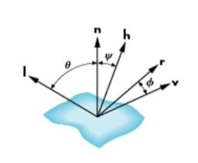

### 1.2 实现效果

Fragment Shader `blinn_phong.fs`中写出了光照计算模块：

- 有时候记录的$\hat n$是反向的，会影响计算。注意到$\hat n$应该始终与人眼看到的反向夹角锐角/直角，即：

	```c++
	if(dot(normal, viewDir)<0) normal = -normal;
	```

- 系数的选取：根据"Q&A"，选取$k_s=0.8m$（$m$为metallic），$k_d=1-k_s$，$k=20r$（$r$为roughness），$k_a=0.02$。

- 环境光与光源无关，由于一个物体的颜色可以看作其接受白色环境光后发射的光颜色，可以令$I_a=\text{diffuse color}$。同时diffuse和specular项的$I=\text{light_color}\times\text{diffuse color}$，diffuse color就是通常的物体颜色，light_color同上，计算时应看作$3\times3$对角矩阵。

- 多个光源时（1）式需要对不同的$I$求和，但是不需要对环境光项求和。

- Gamma校正：由于亮度和颜色值的非线性性，需要进行gamma校正以保证颜色看起来是线性的：

	```c++
	Color.rgb=pow(Color.rgb,vec3(1.0/2.2));
	```

下图给出了在是否进行法向反向处理两者情况下的结果：

|        | Box On Plane           | Cornell                |
| ------ | ---------------------- | ---------------------- |
| 不处理 | 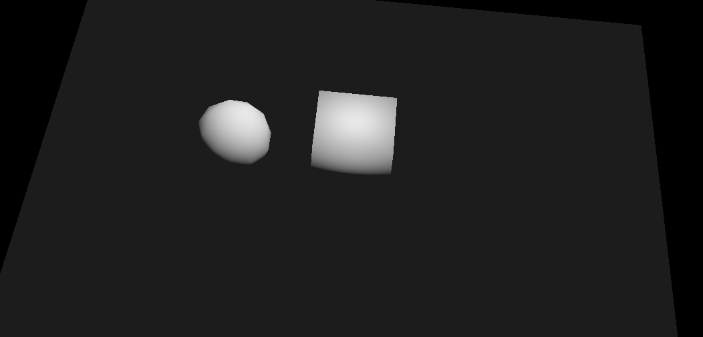 | 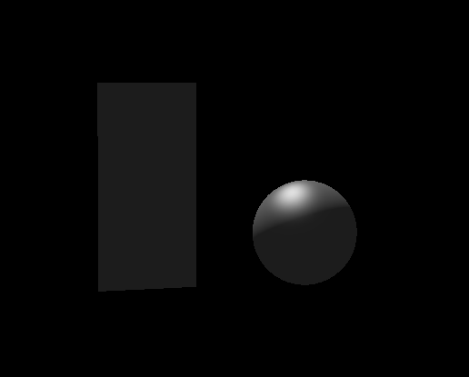 |
| 处理   | 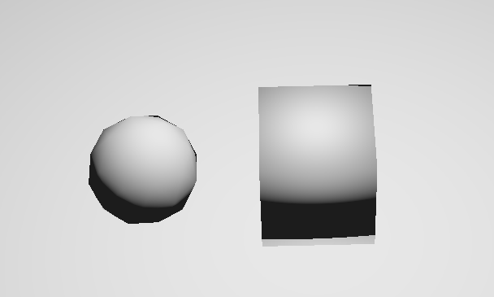 | 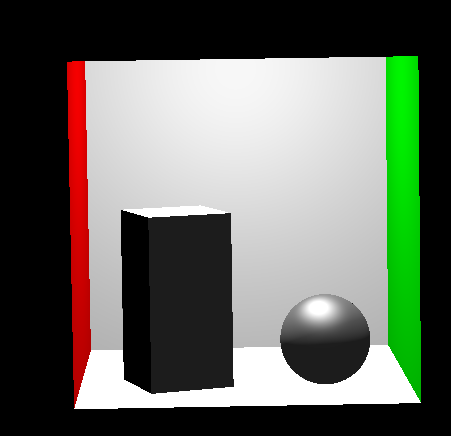 |

可以发现经过法向处理后的结果可以避免侧面法向相反的现象，但是由于法向是插值形成，正方体同一个面上的法向会不同，导致一定问题。这本质上是这个图形没有进行法线贴图Normal map的原因，详见1.3。对于制作精良的`Sponza.usda`，可以看到较为逼真的光照效果（图中光照是从$z=-10$到$z=10$的遍历（光源逐渐上升），对反向的法向进行处理）

| 狮子头       |  |
| ------------ | -------------------- |
| 旗帜和花坛等 |  |
| 穹顶         |  |

花坛和地板在$z<0$时候几乎是黑色的，因为只有微弱的环境光。

本报告对应的程序节点图如下：

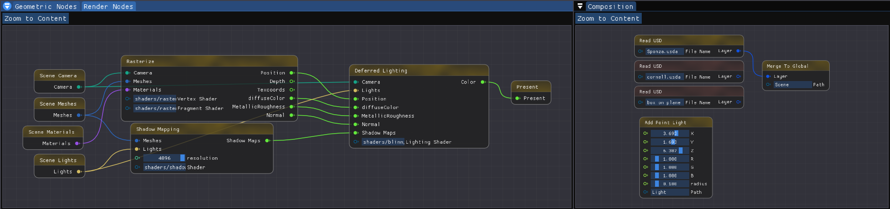

### 1.3 法线贴图 Normal map

#### 算法原理：

利用单独存储的一个法线贴图实现在一个面上的更多细节，光照时体现更多的纹理层次。

存储的法向是在切线空间的结果，其中切线空间是片元法向（与存储的大致相同，但是存储的有更多层次和细节），如图所示：


需要计算切线$T$和副切线$B$在模型空间的坐标。LearnOpenGL提供了参考方法：

```c++
GLfloat f = 1.0f / (deltaUV1.x * deltaUV2.y - deltaUV2.x * deltaUV1.y);

tangent1.x = f * (deltaUV2.y * edge1.x - deltaUV1.y * edge2.x);
tangent1.y = f * (deltaUV2.y * edge1.y - deltaUV1.y * edge2.y);
tangent1.z = f * (deltaUV2.y * edge1.z - deltaUV1.y * edge2.z);
tangent1 = glm::normalize(tangent1);

bitangent1.x = f * (-deltaUV2.x * edge1.x + deltaUV1.x * edge2.x);
bitangent1.y = f * (-deltaUV2.x * edge1.y + deltaUV1.x * edge2.y);
bitangent1.z = f * (-deltaUV2.x * edge1.z + deltaUV1.x * edge2.z);
bitangent1 = glm::normalize(bitangent1);
```

进行了UV空间和模型空间的转换。得到TBN矩阵，就可以把法线贴图转换到模型坐标下：

```c++
mat3 TBN = (mat3(tangent, bitangent, normal));
normal = normalize(TBN * (normalmap_value*2.0-1.0));
```

操作$\text{normalmap_value}\times2-1$是因为原来其被压缩到了$[0,1]\times[0,1]\times[0,1]$的rgb色彩空间中。

#### 效果展示：

由于Normal map的正确实现需要预先给定正确的法向，只有`Sponza.usda`满足要求！Normal map实现的Fragment Shader在`rasterize_impl_n.fs`文件中。如图给出了不同场景下，相同光照Normal map和普通法向的区别：

|            | 插值Normal                 | Normal Map             |
| ---------- | ---------------------- | ---------------------- |
| 狮子头 | 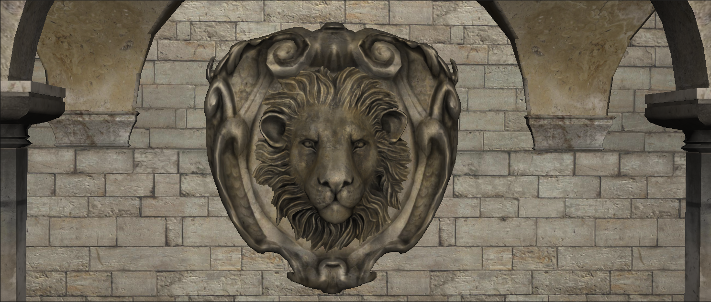 | 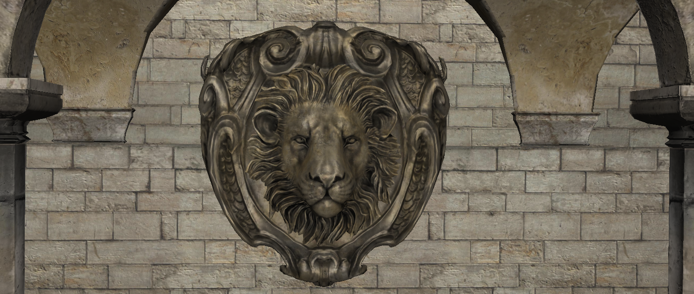 |
| 旗帜和花坛 | 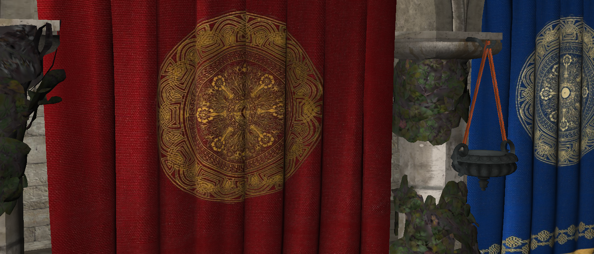 | 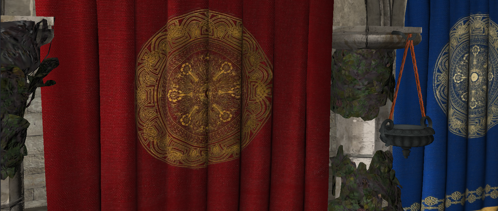 |
| 穹顶 | 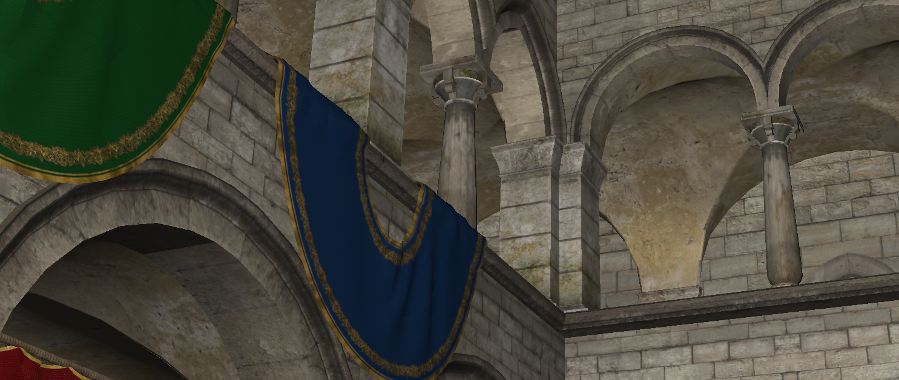 | 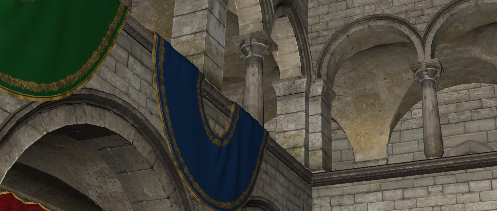 |

可以看到Normal Map提供了更多的纹理和材质现象（例如狮子头更加立体的五官，布料更加偏向漫反射而非镜面反射）。

#### 光源颜色与图像：

根据上面的说明，物体反射的颜色中，diffuse和specular与光源颜色有关，ambient与光源颜色无关（默认为白色乘上diffuse color，即就是diffuse color），三者都与物体颜色有关，如图所示：

| 光源颜色 | 效果                 |
| -------- | -------------------- |
| 红       | 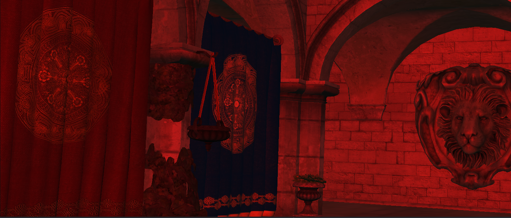 |
| 绿       | 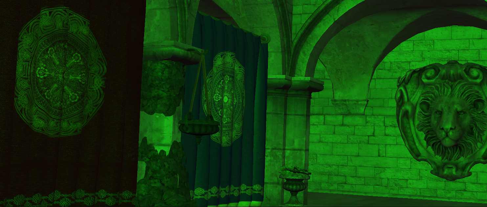 |
| 蓝       | 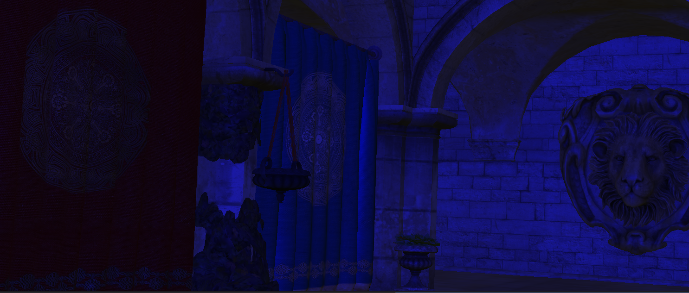 |

这里对`lights[i].color`进行了归一化，以避免色彩溢出。

## 二、Shadow Map

### 2.1 算法原理 

Shadow Mapping节点给出了光源视角的**视图矩阵`light_view`**和**投影矩阵`light_projection`**，模型空间中的一点坐标`pos`，转换到光源视角的坐标为

```c++
vec4 clipPos = light_projection * light_view * (vec4(vertexPosition, 1.0));
```

> 假设某个点的三维坐标为$\vec x$，一个可行的“线性”变换为$\vec{x'}=\mathbf{R}\vec x+\vec a$，分布为平移和旋转，其中旋转矩阵（张量）$\mathbf{R}\in O(3)$（正交阵），那么上式可以有齐次的表述：
> $$
> \begin{pmatrix}\vec {x'}\\1\end{pmatrix}
> =\begin{pmatrix}\mathbf R&\vec a\\\vec0&1\end{pmatrix}
> \begin{pmatrix}\vec x\\1\end{pmatrix}
> $$
> 所以可以用四维矩阵与四维向量乘法来表示线性的旋转、平移操作。

不过视图矩阵和投影矩阵并没有上述那么好的性质，得到的`clipPos.w`不一定为1，需要归一化，从而得到光源视角相机的坐标（需要除以2加上0.5以“归一化”）：

```c++
shadow_map_value = texture(shadow_maps, vec3((clipPos.xy/clipPos.w)*0.5+0.5, lights[i].shadow_map_id)).x;
```

从Shadow Map的这个坐标取值就可以得到该点对应的深度，因为其定义如下：

```c++
shadow_map = (clipPos.z / clipPos.w); // 归一化
```

### 2.2 实现效果

在deferred lighting节点编辑Fragment Shader`blinn_phong_s.fs`，给出了阴影贴图效果：

| Box On Plane         | Sponza               |
| -------------------- | -------------------- |
| 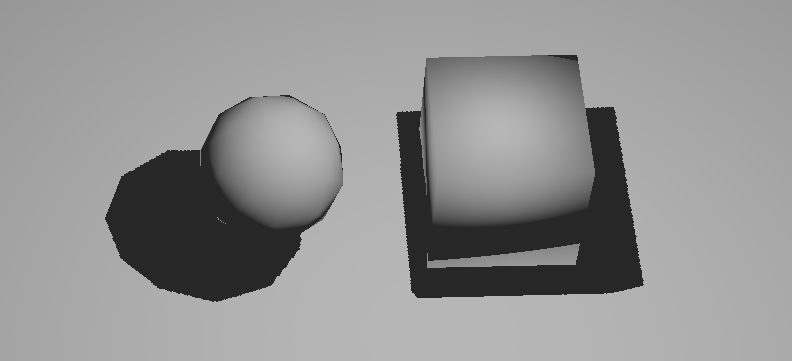 |  |

可以看到Sponza中布左侧的光源使得布的阴影投至地面，穹顶上也有阴影即将遮蔽狮子头。

更多Sponza的例子：

| 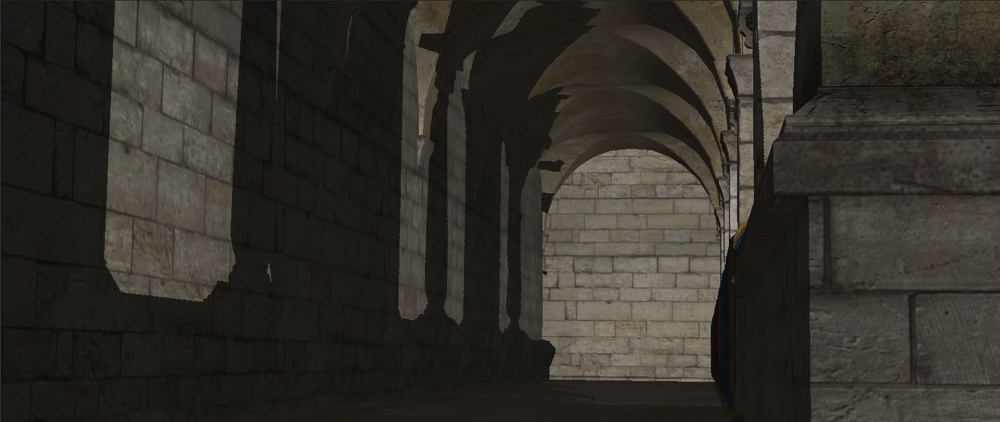                                         |
| ------------------------------------------------------------ |
| 中间的光透过二层的石柱打到二层区域，可以看到石柱的影子。     |
| 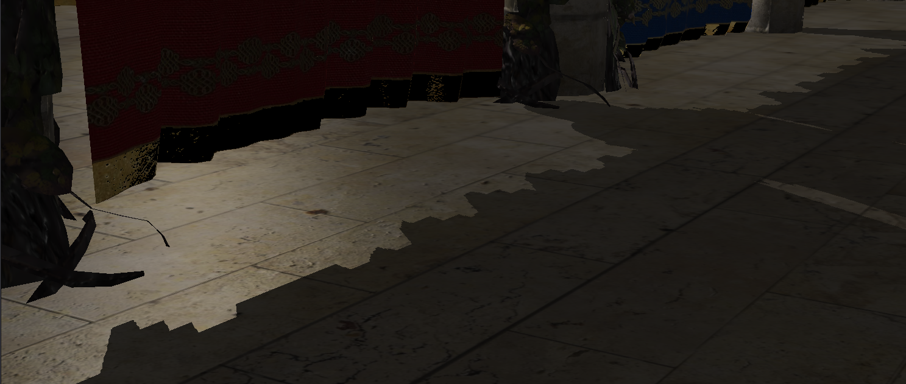                                         |
| 影子在布边缘的变得十分像素化，尽管已经给了4096的分辨率（注：应该是框架或者OpenGL有限制，这个分辨率不能很大，测试时不能到$16384\times16384$的规模） |
| 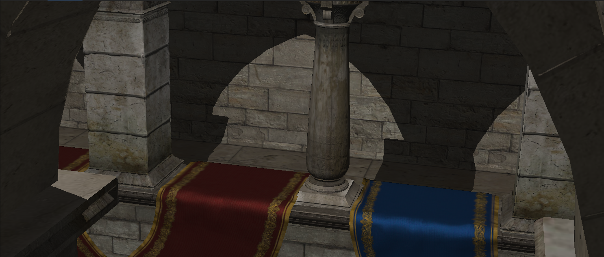                                         |
| 二楼穹顶可以被正确投影                                       |

### 2.3 不足

测试发现问题及有可能的原因：

- 如图所示，在`Sponza.usda`中，如果令光源$x=0,\,y=0$，改变$z$（-10到+10），可以看到只有一定范围内的区域被照亮，这应该是因为所谓的“光源相机视角”不能很好处理这个方向的照射。在代码中输出矩阵，发现`light_projection`的前两行矩阵元素都为0，说明得到的`clipPos.xy=vec2(0.0)`，并不能体现深度信息的分布。

	同时由于相机只有$120^\circ$张角，不是所有地方都可以捕获到深度信息，从而导致不能正确判断阴影。

	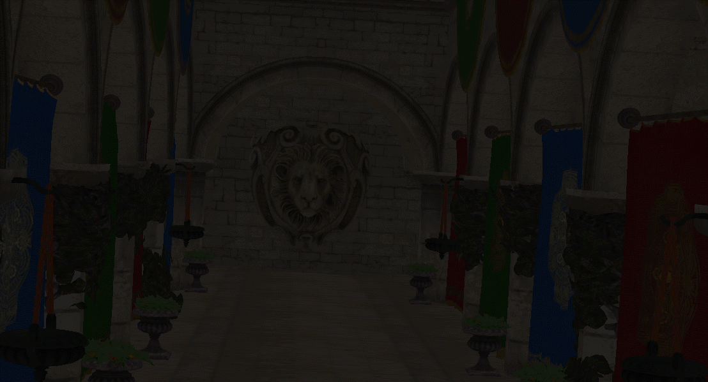

- 部分地方有奇怪的阴影出现，例如图中$x=0,\,z=0$，$y$变化得到的奇怪结果，这可能是因为上述原因，以及shadow map的分辨率不足。

	

## 三、PCSS（Percentage Close Soft Shadow）

### 3.1 算法原理

由于像素的对应不精确导致了边缘很锋利，这并不是实际光源表现出的行为（一是实际光源不能抽象成点光源，如果认为是一系列点光源，成像则会互相有微小的差别，形成边缘光晕；同时光的衍射现象也可以使得锋利的影子边缘不好得到，尽管不是最重要原因）。

直观上可以把光源分成很多个，每一个都进行一次Shadow map，但是这很耗费计算资源。类似物理上的“微扰”论，我们可以认为光源的非点特性等效于某一个点在光源相机中的像的非点特性，或者说把像看成非点的：

~~~c++
vec3 PCSS_pos = pos + normalize(rand_vec) * lights[i].radius;
~~~

上面代码就是随机取了一个点进行计算。需要计算很多次，然后取平均（即没被遮住次数除以总次数）作为阴影系数乘上反射光项。

- 随机数的选取：由于OpenGL Shading Language不支持C++STL库，不能直接使用随机函数，这里使用一个常用的$[0,1]$间伪随机数发生器：

	```c++
	float random(vec2 seed) { // false random number generator
	    const vec2 random_vec = vec2(12.9898, 78.233);
	    return fract(sin(dot(seed, random_vec)) * 43758.5453123);
	}
	```

	通过（可能是有序的）`seed`创造一堆随机无规律的数，这样就可以定义`rand_vec`，对一系列j呈随机特性：

	```c++
	vec3 rand_vec = vec3(random(vec2(12.34+j,56.78-j)),
	                     random(vec2(90.12+j,34.56-j)),
	                     random(vec2(78.90+j,12.34-j)));
	```

### 3.2 实现效果

如表，在`box_on_plane.usda`中探索不同参数带来的不同效果，对应Shader为`blinn_phong_s.fs`：

| 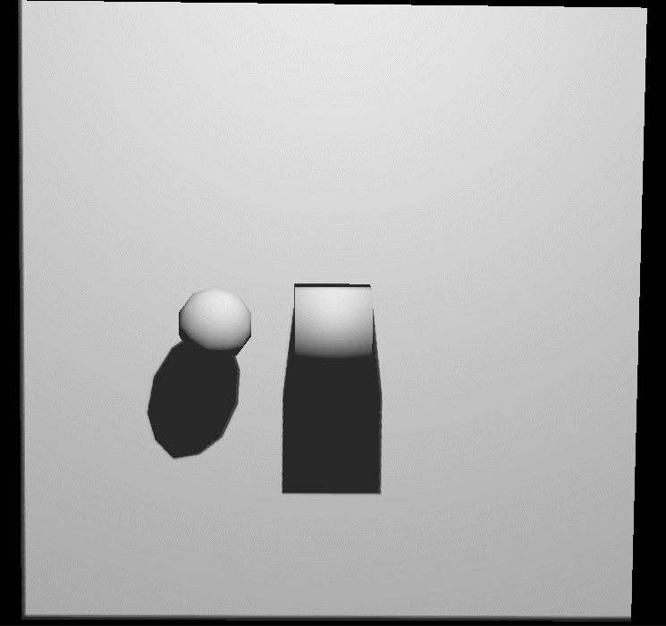            | 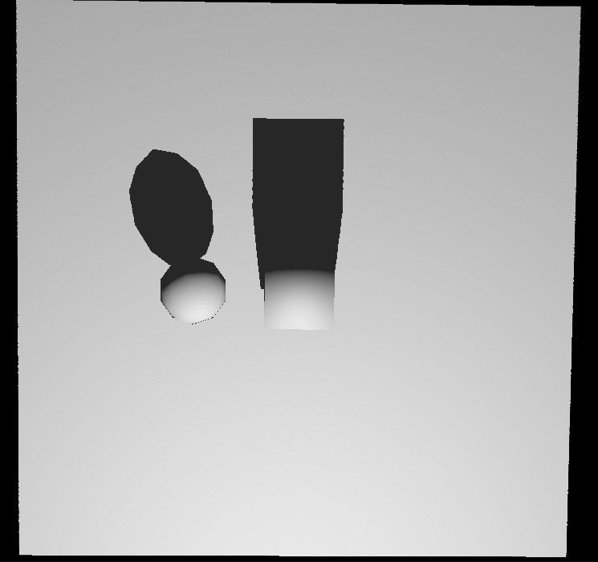                                   |
| ------------------------------- | ------------------------------------------------------ |
| 固定$x,z$，改变$y$              | 固定光源位置，改变弥散的半径`lights[i].radius`，从0到1 |
| 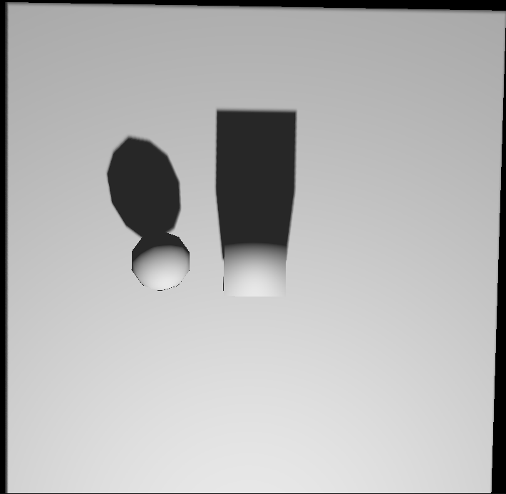            | 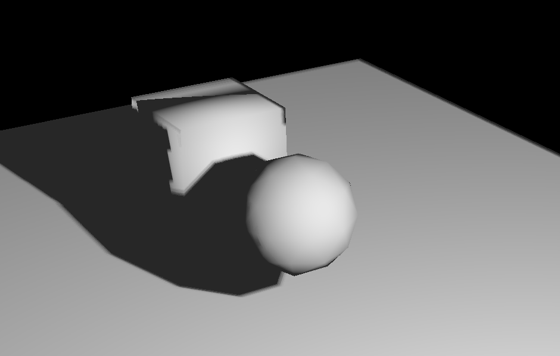                                   |
| 上述采样个数为16，此处更改为256 | 改变光源位置，可以实现圆球的阴影遮盖立方体             |

同样给出`Sponza.usda`中与Shadow map部分类似的场景表现：

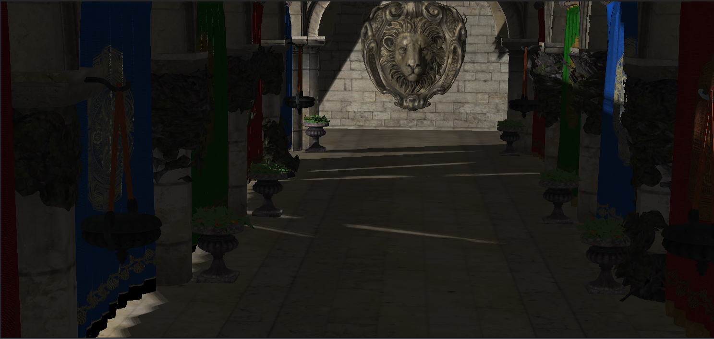

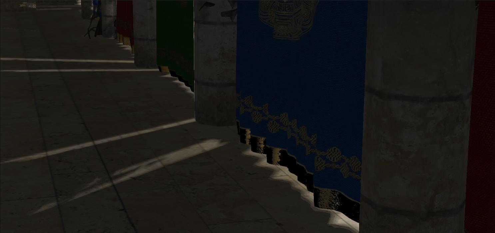

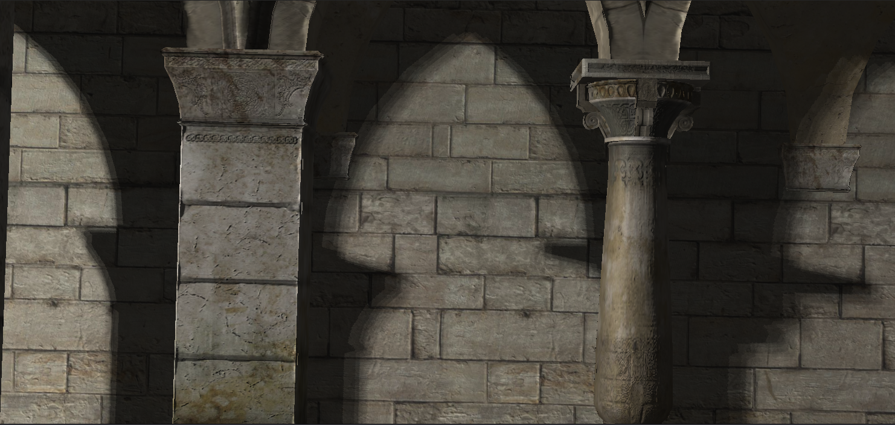

