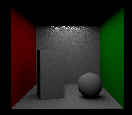

# Homework 7 Path Tracing 路径追踪

###### 85 夏子汐 PB22000057

## 一、算法概述

### 1.1 全局光照渲染方程

#### BRDF

由于光从光源发射后可以经过一系列反射（折射）再到达相机，所以为了计算相机上一个点的光强，需要计算**物体上某一点发出的光强**。这个物理量显然与方向有关，记作$L(\vec x,\vec\omega)$，$\vec\omega$为出射方向。

物体上一个点发光是因为（漫）反射（和折射）了入射光，这个过程与物体的材质有关，使用双线性反射分布函数BRDF表征：

> 假设光学系统是线性的，那么由于入射光产生出射光可以分解为一系列方向的入射光引起出射的叠加。假设只有$\vec\omega_i$方向有入射光，出射光可以沿各种方向，那么我们可以设出射方向$\vec\omega$对应强度与入射光的比例为$f(\vec\omega)$。
>
> 对于所有点和方向，可以给出统一的一个函数$f(\vec x;\vec\omega_i,\vec\omega)$，就是所谓的BRDF。
>
> 严格上来说，上述的$\vec\omega_i$和$\vec\omega$都是沿该方向的（同）一个极小的立体角的范围内，计算其光强。

物体的BRDF可以大致分为三类：

- Diffuse漫反射物体：沿各个方向的出射光相同，说明$f$为一个常量。
- Glossy近似镜面反射物体：沿镜面反射方向光强最大，沿其他方向光强（快速）衰减，几乎只分布在镜面反射方向极小的立体角上。`metallic`参数就是反应物体镜面反射程度的，参数越大，允许的立体角就越小。
- Specular镜面反射物体：只能进行镜面反射和按照斯涅耳定律的折射，这时候的$f$理应使用一个$\delta$函数描述。

#### 渲染方程

由上，可以得到物体某点沿某个方向发出的光强的公式：$L(\vec x,\vec \omega)=\int L(\vec x,\vec\omega_i)f(\vec x;\vec\omega_i,\vec\omega)d\vec\omega_i$。

此式存在两个问题：

1. 光强是能流密度，“密度”表示要除以面积，然而对于同一个$\vec x$上面元$d\sigma$，发出光的面积应该乘以一个因子$\vec n(\vec x)\cdot\vec \omega_i$，也就是$\cos<\vec n(\vec x),\vec \omega_i>$，其中$\vec n(\vec x)$表示；
2. 有些物体可能自己发光，加上自发光项$L_e(\vec x,\vec\omega)$。

综合得到渲染方程：
$$
L(\vec x,\vec \omega)=L_e(\vec x,\vec\omega)+\int L(\vec x,\vec\omega_i)f(\vec x;\vec\omega_i,\vec\omega)(\vec n(\vec x)\cdot\vec\omega_i)d\vec\omega_i
$$

### 1.2 光线追踪算法

 使用伪代码方式描述算法：

```
Trace(point p, vector d, int step){
	if(step > max) return background_color;
	point q = intersect(p, d, status); // 光线（p出发沿d方向）求交
	if(status == light) return light_color; // 达到光源
	if(status == NULL) return background_color; // 没有交，返回背景
	n = normal(q);
	r = reflect(q,n);
	t = transmit(q,n);
	local = phong(q,n,r); // 计算局部光照
	reflected = trace(q,r,step+1); // 如果光线反射
	transmitted = trace(q,t,step+1); // 如果是发光体
	return local + reflect + transmit;
}
```

### 1.3 路径追踪方法

#### Monte Carlo积分方法

计算积分$\int_a^bf(x)dx$，黎曼积分理论给出了一种估计方法$\cfrac{b-a}{n}\sum_{i=1}^nf(\xi_i)$。注意到如果$\xi_i$是均匀分布，任意选取的，那么可以看作一个随机变量$X_i$，均匀分布，pdf为$p(x)=\cfrac1{b-a}$，所以积分的估计变为$\cfrac1n\sum_{i=1}^n\cfrac{f(x_i)}{p(x_i)}$。

令$g(x)=\cfrac{f(x)}{p(x)}$，那么随机变量的函数$g(X)$的期望为$E(g(X))=\int g(x)p(x)dx=\int f(x)dx$，又由于$g(X)$的平均值是期望的无偏估计，可以使用平均值逼近。

#### 路径追踪

使用伪代码描述算法：

```
shade(p, w){
	uniformly sample a light at x';
	direct light L_dir = L(x') * f() * cos(theta) * cos(theta') / (distance ^ 2) / pdf;
	// L as the lumiance, f() as the BRDF,
	// theta(') as the angle between ray and normal(' as light normal),
	// distance as the distance between p and x',
	// pdf as 1/A(rea)
	
	Russian Roulette with probably P_RR;
	uniformly sample the hemisphere, get wi, and pdf = 1/2PI;
	if the ray r(p, wi) hit an object at q:
		L_indir= shade(q, -wi) * f() * cos(theta) / pdf / P_RR;
	// theta as the angle between ray and normal.
}
```

## 二、Rect光源

### 2.1 部分编程事项

1. 定义`intersect`函数求交时，为了加快速度，需要提前进行AABB判断，这里可以把光源放在一个沿着坐标轴的立方体`GfRange3d`中，然后再判断（这里使用的是`GfBBox3d`箱元素）。不过这里不加也可以。
2. 使用`GfPlane`类定义光源平面，可以方便地获得平面的法向量`plane.GetNormal()`。
3. `    auto distance = (sampledPosOnSurface - pos).GetLength();`。

### 2.2 效果展示

固定光源位置（$x=y=0$，$z=0.828$），调整光源大小得到如下结果：

|            | width=0.1              | width=1                | width=5                |
| ---------- | ---------------------- | ---------------------- | ---------------------- |
| height=0.1 |  |  |  |
| height=1   |  |  |  |
| height=5   |  |  |  |

- 随着光源大小增大，影子变得更加柔和。如果光源无穷大，影子应该非常弱、小，例如右下角的图片。
- 小的光源也会产生更加局部的效果，例如影子更加锐利，光泽更加丰满。左下角和右上角的图片中产生的光点是光源与物体（近乎）相交产生的效果。
- 右下角图片的顶部出现了很多噪点，应该是因为与光源很近，采样的随机性导致得到的“距离光源采样点的距离”偏差很大。
- 不能看见顶部是因为光源是有方向的，不能直接射到顶部；在加入Indirect后可以看到。

针对length=5，height=5，采用不同的SPP（samples per pixel），可以得到不同精度的图片，如下：

| SPP=16               | SPP=64               | SPP=256（默认）      | SPP=1024             |
| -------------------- | -------------------- | -------------------- | -------------------- |
|  |  |  |  |

可以明显看到SPP的增加可以有效减少噪点数量，但是这在一定程度上会降低效率。下一部分会仔细分析。

## 三、路径追踪

### 3.1 概览

保持上述参数不变（length=5，height=5），可以得到如下结果：


相比于DirectLightIntegrator，路径追踪体现了二次甚至多次反射的结果，效果更好。

### 3.2 效率

使用如下代码计算渲染用时，得到上图的渲染用时为25068ms。

```c++
// renderer.cpp附加的内容

#include <chrono>
#include <iostream>

void Hd_USTC_CG_Renderer::Render(HdRenderThread* renderThread)
{
    auto start_time = std::chrono::steady_clock::now();

    ...
    
    auto end_time = std::chrono::steady_clock::now();
    auto duration = std::chrono::duration_cast<std::chrono::milliseconds>(end_time - start_time);
    std::cout << "Render time:" << duration.count() << std::endl;
}
```

给出不同SPP的结果和用时：

| SPP     | 16                   | 64                   | 256                  | 1024                 |
| ------- | -------------------- | -------------------- | -------------------- | -------------------- |
| 结果    |  |  |  |  |
| 用时/ms | 2145                 | 10262                | 25068                | 124417               |

很明显随着SPP上升，噪点数量降低。

### 3.3 Russian Roulette

使用俄罗斯轮盘方法进行“剪枝”，即每一次都只有一定的概率`P_RR`，计算后续的光强`shade(q, -wi)`。为了保持期望不变，光强要除以`P_RR`。

这样能够使得计算的复杂度降低，但是效果会变差，是否能够通过增加SPP或者反着以获得更好效果呢？如下：

| 图片+用时（ms） | SPP=16 | SPP=64 | SPP=256 | SPP=1024 |
| ------------- | ------ | ------ | ------- | -------- |
| $P_{RR}=1$    | 2145 |  10262 |  25068 |  124417|
| $P_{RR}=0.75$ | 1281| 5498| 19088| 74938|

说明选择不同的SPP和$P_{RR}$，可以在比较小的时间上获得相对还可以的效果。由于时间原因没有测试$P_{RR}=0.5$和$P_{RR}=0.25$情况。