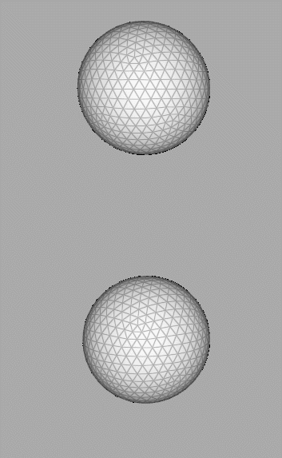

# Homework 8 Mass Spring 布料仿真

###### 85 PB22000057 夏子汐

###### 内含大量`.gif`动图，建议直接查看`.md`文件。

## 一、物理原理

### 1.1 质点弹簧假设

布料看作由一系列原子构成，原子之间作用力可以近似为最近邻，在弹性力近似下，可以看作相邻原子用弹簧连接。

> 这种近似在研究固体物理中晶体的行为时非常常用。对于不受外力的晶体，最近邻原子距离是一个定值，此时没有弹性力作用。如果晶体中有原子产生了一定的偏移，会带动临近原子运动，从而产生晶体整体的运动。在“周期性边界条件”和“简谐近似”下，晶体振动可以由一系列的基本振动（格波）叠加形成。
>
> 每个格波的“角频率”和“波矢”具有“色散关系”，长波极限下某些振动模式近似有$\omega=v_sq$，表示格波传播速度是一个定值，即物体中的声速，这些振动模式称为声学支，与之相对的时角频率与波矢几乎无关的光学支。近代物理学发现格波的振幅具有量子化特性，也称晶格振动的量子化为一个个“声子”，声子具有和光子等量子类似的物理特性，例如能量和“准动量”。
>
> 上述近似和假设在解释色散关系，晶体与光子、电子等相互作用中能够较好解释实验结果。

原子尺度过小，原子过多，几乎不能计算。为了减小计算量，可以增大原子“大小”，变为一系列分立的“质点”和“弹簧”（连接），这种近似是有物理上的对应的理论，说明大概可行。

本实验中给出的“弹簧”是矩形网格进行三角化后的结果，如下图，由于假设每个弹簧的劲度系数相同，显然这个物体不能看作各向同性的，与上述物理模型不同，但是仍然可以较好地模拟。


### 1.2 运动方程

#### 半隐式积分
$$
\begin{align}
\mathbf{x}^{n+1} &= \mathbf{x}^{n} + h \mathbf{v}^{n+1}\\
\mathbf{v}^{n+1} &= \mathbf{v}^{n} + h \mathbf{M}^{-1} (\mathbf{f} _ {\text{int}}(\mathbf{x}^n) + \mathbf{f} _ {\text{ext}} )
\end{align}
$$
弹性力：$\mathbf{f}_{\text{int}} = -\nabla E$；总体的能量：$E = \sum_{i} E_i = \sum_{i} \frac{k}{2} \left(\|\mathbf{x}_{i}\| - L\right)^2$。

阻尼系数：`vel *= damping`。

#### 隐式积分
$$
\begin{align}
\mathbf{x}^{n+1} &= \mathbf{x}^{n} + h \mathbf{v}^{n+1} \\
\mathbf{v}^{n+1} &=\mathbf{v}^{n} + h \mathbf{M}^{-1} (\mathbf{f} _ {\text{int}}(\mathbf{x}^{n+1}) + \mathbf{f}_{\text{ext}} ) 
\end{align}
$$
转变为使用牛顿法解决最优化问题：
$$
\min_{\mathbf{x}} \quad g(\mathbf{x}) = \frac{1}{2 h^2}(\mathbf{x} - \mathbf{y})^\top   \mathbf{M} (\mathbf{x} - \mathbf{y}) + E(\mathbf{x})
$$
定义弹簧的Hessian矩阵
$$
\begin{align*}
\mathbf{H}_i &= \nabla^2 E_i  \\
&=k \frac{\mathbf{x}_i {\mathbf{x}_i}^\top}{\|\mathbf{x}_i\|^2}+k\left(1-\frac{L}{\|\mathbf{x}_i\|}\right)\left(\mathbf{I}-\frac{\mathbf{x}_i \mathbf{x}_i^{\mathrm{T}}}{\|\mathbf{x}_i\|^2}\right) \\
\end{align*}
$$
总共的Hessian由每个弹簧根据点坐标序号组合得到，记为$\mathbf H_k$，那么能量 $g$ 的Hessian矩阵 $\mathbf{H} = \nabla^2 g=\cfrac{1}{h^2}\mathbf M+\mathbf H_s$。

能量 $g$ 的导数 $\nabla g(\mathbf{x}) = \frac{1}{h^2} \mathbf{M}(\mathbf{x} - \mathbf{y}) + \nabla E(\mathbf{x})$。

牛顿迭代法求得最后解
$$
\mathbf{x}^{n+1} = \mathbf{x}^n - \mathbf{H}^{-1} \nabla g (\mathbf{x}^n)
$$
### 1.3 加速方法
根据论文，总能量
$$
E = \frac{1}{2} \mathbf{x}^\top \mathbf{L}\mathbf{x} - \mathbf{x}^\top \mathbf{J} \mathbf{d}
$$
其中 $\mathbf{L} \in \mathbb{R}^{3n\times 3n}, \mathbf{J} \in \mathbb{R}^{3n \times 3s}$ ,  $n$ 为顶点个数， $s$ 为弹簧个数（边的个数）,  $\mathbf{d} \in \mathbb{R}^{3s \times 1}$ 为所有 $\mathbf{d}_i$按顺序拼起来的长向量 ：
$$
\mathbf{L}=\left(\sum_{i=1}^s k_i \mathbf{A} _ i \mathbf{A} _ i^{\top}\right) \otimes \mathbf{I} _ 3, \\
\mathbf{J}=\left(\sum_{i=1}^s k_i \mathbf{A}_i \mathbf{S}_i^{\top}\right) \otimes \mathbf{I}_3
$$
将坐标和弹簧原长矢量进行非线性优化，需要使用Local-Global的流程，如下：
1. Local：$$ \mathbf{d}_i = L_i \frac{\mathbf{x}_i}{\|\mathbf{x}_i \|} $$
2. Global：优化能量等价于对其求导数（一阶最优条件）然后令导数=0，这一过程会转化为下面这个线性方程组的求解：
$$
\mathbf{A} \mathbf{x} = \mathbf{b}
$$
其中 $\mathbf{A} = \mathbf{M} + h^2 \mathbf{L} \in \mathbb{R}^{3n \times 3n}$ 以及 $\mathbf{b} = h^2 \mathbf{Jd} + \mathbf{My}\in \mathbb{R}^{3n}$, $\mathbf{x} \in \mathbb{R}^{3n}$. 注意到 $\mathbf{A}$ 为正定的，$\mathbf{A}$ 也不会变，所以只需要在仿真一开始计算一次！可以对 $\mathbf{A}$ 进行预分解，然后不断调用预分解好的求解器计算即可！从而达到加速效果。

## 二、两种积分方法
### 2.1 半隐式积分方法

如下图，固定参数`h=0.01`，`stiffness=100`，`damping=0.995`，选择不同的图得到的结果如下：

| 1x1                    | 2x2                    | 10x10及以上            |
| ---------------------- | ---------------------- | ---------------------- |
|  |  |  |

大型图片发生了爆炸，现改变`h=0.001`，得到结果：

| 10x10                   | 20x20                    | 40x40            |
| ---------------------- | ---------------------- | ---------------------- |
|  |  |  |

#### 讨论：

1. 将不同精细度的网格的弹簧劲度系数设置为相同是不正确的。课上讲过杨氏模量的定义，表明了真正守恒的是应力和应变的比值。假设网格不受重力作用，其中一整条边固定，对边施加均匀的力$F$，设被拉伸长度$\Delta x$，那么（不考虑斜向弹簧作用，考虑了结果也是一样的）由于这个力被**精细度`n_fix`**个弹簧共享，每个弹簧的劲度系数$k=\cfrac{F}{\Delta x\cdot\text{n_fix}}$，与精细度成反比。考虑这个修正的情况下，给出结果并不支持这个论述，应该是因为质量的选择和过程中的计算。

2. 速度的`damping`系数理论上应该与时间有关。假设空气阻力$F=-\gamma v=m\cfrac{\mathrm dv}{\mathrm dt}$，解得$v=v_0e^{-\frac{\gamma}{m}t}$，那么$\text{damping}=e^{-\frac\gamma m h}$，与时间间隔呈指数关系。如下所示，选用`10x10`网格，$k=25$，$\cfrac{\gamma}{m}=1$，不同$h$结果如下表。

	| $h=0.01$               | $h=0.005$              | $h=0.001$              |
	| ---------------------- | ---------------------- | ---------------------- |
	| $\text{damping}=0.99$  | $\text{damping}=0.995$ | $\text{damping}=0.999$ |
	|  |  |  |

	通过摆动的幅度可以看出近似的阻尼。

3. 固定点的设置：为了不让固定点移动，可以每一次让固定点的加速度为0（约束力与外力+弹性力平衡，符合物理实际），如下：

	```c++
	for (int i = 0; i < X.rows(); ++i)
	    if (dirichlet_bc_mask[i]) {
	        acceleration(i, 0) = acceleration(i, 1) = acceleration(i, 2) = 0;
	        vel(i, 0) = vel(i, 1) = vel(i, 2) = 0; // 其实可以不用这一句
	    }
	```

4. 不同固定情况的结果：选用`10x10`网格，给出多种固定情况，如下图所示。

	| 固定边上一点            | 固定对角                | 固定四角                |
	| ----------------------- | ----------------------- | ----------------------- |
	|  |  |  |

5. 上面的图中可以看到有一些时候会出现黑色，这是因为面片交叠，也就是所谓的“穿模”，解决方案参见“碰撞”一节。

6. 质点弹簧网格并不是沿正方形四边方向“各向同性”的，这也正是正方形边方向对称性不保证的原因（很明显这种不对称性远大于浮点数误差），理论上变成叉形网格或者删去斜边可以达到“各向同性”效果。

### 2.2 隐式积分方法

隐式积分方法主要用于解决半隐式积分方法时间间隔（“帧时间”）不能过大的问题，这样会导致计算量增大（尽管隐式积分方法计算量也很大）。这里给出`cloth1.png`贴图`10x10`的效果，探究同一个网格下，不同的$k$的效果，使用的是$h=0.1$，体现了隐式积分的优越性。

| $k$                   | $10$                   | $100$  | $1000$ |
| --------------------- | ---------------------- | ------ | ------ |
| 图像                  |  |        |        |
| 帧计算用时（$\mu s$） | 约1000                 | 约1100 | 约1200 |

固定$k=25$，更改$h$，如下表所示，粗糙的时间积分可以有观感上没问题的近似。由于积分过程能量自然减小，不用`damping`阻尼。

| $h$                   | $0.001$                   | $0.01$  | $0.1$ |
| --------------------- | ---------------------- | ------ | ------ |
| 图像                  |  |        |        |
| 帧计算用时（$\mu s$） | 约1100                 | 约1100 | 约1200 |

帧计算用时基本相同，总计算用时与时间间隔成反比。精细的积分计算有着更小的阻尼效应和“更丰富的细节”（但是这是一种物理上不太能够发生的夸张的过程，极其无规则）。

### 2.3 应用：含有“风”的情况

风力和重力有着类似的定位，这样就没有意思了，不如直接修改重力。这里修改了外力（加速度）计算方法，提供了与坐标有关的力`wind_acc(X)`接口，计算加速度变为：

```c++
Eigen::Vector3d acceleration_ext = gravity;
...
Eigen::MatrixXd acceleration(X.rows(), 3);
acceleration.rowwise() = acceleration_ext.transpose();
for(int i=0;i<X.rows();++i){
    auto wind=wind_acc(X.row(i));
    acceleration.row(i)+=wind;
}
```

风加速度$a_w$举例如下：

| $a_w=10r=10||X_i||$，且设$z$分量为0，同时忽略重力 | 同左边，但是不固定点   |
| ------------------------------------------------- | ---------------------- |
|                             |  |

> 物理上在绕$z$轴以$\omega$旋转的参考系中看物体，会受惯性离心力，产生的加速度为$a=\omega^2r$，与$a_w$形式相同，可以看作物体在这样的非惯性系中的运动。
>
> 惯性离心力产生的势能$U=-\cfrac12m\omega^2r^2$，物体趋向势能大的地方，也就是趋向于远离中心（就是原来Mesh的正中央）。所以左边物体会绕道固定点后面，以减小能量。
>
> 右边物体刚开始产生了可见的变形，是因为非“各向同性”产生，之后朝着一个方向远去，是因为追求势能最小。这也说明初始位形是一个**不稳定平衡**，微扰（这里可以看作浮点数误差）就可以使其远离平衡位置不复回。

左图出现了明显的布料“扭转”过程，这是质点近似和没有“穿模”判断导致的结果。

| $a_w=\cfrac{-(X_i-X_0)}{||X_i-X_0||^3}$，中心$X_0=(0,0,-2)$，忽略重力，$k=1$ | 同左边，但是不固定点，$k=25$ |
| ------------------------------------------------------------ | ---------------------------- |
|                                        |        |

> 这对应物理中的万有引力，右图出现“爆炸”是因为当物体靠近力心时万有引力发散。
>
> 真实世界中不存在这种发散，因为在宏观上不可能有着质点，也就是物体的最近距离是有限制的；如果物体可以穿过，根据万有引力计算，均匀分布的球形物体（半径$R$）对外的引力大小和距中心距离$r$的关系是：
> $$
> F\propto\begin{cases}&\cfrac{1}{r^2}&r>R\\&r&r<R\end{cases}
> $$
> 不会发散。对于微观情况，其他作用力出现，并且强于万有引力，起主导作用。

## 三、碰撞

### 3.1 球形碰撞处理——半隐式积分方法

半隐式积分方法通过力的观点看待运动，处理碰撞问题比较方便。这里认为碰撞均为完全非弹性的，那么只要快要碰到了就让法向速度变为0（也可以附加让法向加速度为0）。

> 物理上可以使用**相轨迹**描述运动，解释如下：
>
> 1. ##### 广义坐标
>
> 	一个物理系统的位形可以由一系列参量描述，**广义坐标**是可连续变化的描述物理系统位形的变量集合。例如上述$n$个质点的系统，位形可以用$3n$个独立坐标表示，即每个点的笛卡尔坐标，记为$q_1,...,q_{3n}$。真正描述物理系统还需要给出质点的速度$\cfrac{\mathrm{d}q_i}{dt}$（$i=1,...,3n$），也就是总共$6n$个物理量。
>
> 2. ##### 哈密顿原理（最小作用原理）
>
> 	当体系的势能与速度无关时，定义**拉格朗日函数**$L(q_i,\dot{q_i},t)=T(\dot{q_i},t)-U(q_i,t)$，即动能减去势能。哈密顿原理认为真实的运动会使得$S=\int_{t_1}^{t_2}L\mathrm dt$最小，通过变分法可以推导出对应的运动方程（欧拉-拉格朗日方程）：$0=\cfrac{\delta L}{\delta q_i}=\cfrac{\partial L}{\partial q_i}-\cfrac{\mathrm d}{\mathrm dt}\cfrac{\partial L}{\partial \dot{q_i}}$。定义**广义动量**$p_k=\cfrac{\partial L}{\partial \dot{q_k}}$，在本作业中（势能与速度无关）中等于传统的动量。可以证明这个方程和牛顿第二定律在大部分情况下等价。
> 	
> 3. ##### 速度相空间和动量相空间
> 
> 		由于广义坐标及广义速度可以**唯一**描述物体的位形和运动状态，如果将其构成一个高维坐标系，那么物体的运动就可以描述为空间中的一条轨迹。这个空间称作**相空间**，轨迹称作相轨迹。
> 
>4. ##### 相轨迹方程
> 
>	在某些情况下广义动量和速度不是一回事，用广义坐标和广义动量同样也可以唯一描述物体的状态，这样就构成了**$(q,p)$相空间**。
> 
>	数学上函数的Legendre变换为：$g(u)=ux-f(x)$，其中$u=f'(x)$（同时要求Hess条件：$f''(x)\neq 0$），注意自变量的改变。拉格朗日量$L(q,\dot q,t)$的变换（参考广义动量的定义）
> 	$$
> 		H(q,p,t)=p_i\dot{q_i}-L(q,\dot q,t)
> 	$$
> 	（Hess条件为$\det(\cfrac{\partial^2L}{\partial\dot{q_i}\partial\dot{q_j}})\neq 0$）定义为哈密顿量。在势能与速度无关的情况下，哈密顿量$H=T+U$。
> 
> 	由Legendre变换性质和拉格朗日方程，哈密顿量满足方程为：
> 	$$
> 		\dot{q_k}=\cfrac{\partial H}{\partial p_k}\quad\quad
> 	\dot{p_k}=-\cfrac{\partial H}{\partial q_k}
> 	$$
> 
> 	这就是相空间中的运动方程，具有对称的形式。

相关代码如下，将速度的法向分量变成0：

```c++
if (enable_sphere_collision)
    // change velocity to avoid collision.
    for (int i = 0; i < X.rows(); ++i) {
        Eigen::Vector3d dis = X.row(i);
        dis -= sphere_center.cast<double>();  // "X-c"
        auto dot = vel.row(i).dot(dis) / dis.norm();
        auto vec = dis * dot / dis.norm();  // vel in the direction of normal
        if (dis.norm() < collision_scale_factor * sphere_radius + dot * h && dot < 0)
            // dot < 0 means it is approaching the sphere. 
            // we should not change it to 0 when it is departing from the sphere.
            vel(i, 0) -= vec[0], vel(i, 1) -= vec[1], vel(i, 2) -= vec[2];
    }
```

效果如下：（`10x10`，`h=0.001`）


#### 讨论：

1. 当然，这时候也不应该有向着球的力（加速度）：
   
   ```c++
   if (dis.norm() < collision_scale_factor * sphere_radius + dot * h) {
   	...
       auto adot=acceleration.row(i).dot(dis)/dis.norm();
       if(adot<0){
           auto acc=dis*adot/dis.norm();
           acceleration(i,0)-=acc[0], acceleration(i,1)-=acc[1], acceleration(i,2)-=acc[2];
   	}
   }
   ```

2. 也可以使用教程里面给出的“惩罚力”方法，效果如下（为了明显体现其特征，使用了$k=10$）：

	

3. 可以看到基于惩罚力的碰撞具有一定的弹性特性，就是说会产生反弹的效果，我认为不够好。而且这种方法不能完全避免穿模，例如下图，调大`h`，就发生了轻微的穿模现象。

	

	

4. 上述方法在时间间隔大时可能会出问题，但是本来半隐式方法时间间隔就不能大，所以就没有问题。

### 3.2 球形碰撞处理——隐式积分方法

#### 基于修改速度、外力的处理方法（$k=100$）

| $h=0.001$              | $h=0.01$               | $h=0.1$                |
| ---------------------- | ---------------------- | ---------------------- |
|  |  |  |

没能达到碰撞的效果，根本原因是**没有去除弹性力法向分量造成的**。

#### 基于惩罚力的处理方法（$k=100$，$h=0.01$）


可以看到有轻微的穿模，这是符合“教程”叙述的。

#### 讨论：

如果把两种方法结合起来，得到如下的结果，可以看到穿模现象几乎没有了。

| $h=0.1$                | $h=0.01$ | $h=0.001$ |
| ---------------------- | -------- | --------- |
|  |  |  |

### 3.3 物体内穿模处理——半隐式积分方法

基本思想就是在两个点很近的时候去除其连线方向靠近的速度和加速度：

```c++
if (inter_collide)
    // change velocity to avoid collision inside.
    for (int i = 0; i < X.rows(); ++i)
        for (int j = 0; j < i; ++j) {
            Eigen::Vector3d dis = X.row(i) - X.row(j); // 相对位置
            if (dis.norm() < 0.01) {
                dis.normalize();
                auto vet = ((vel.row(i) - vel.row(j)).dot(dis)) / 2; // 相对速度法向分量
                auto act = ((acceleration.row(i) - acceleration.row(j)).dot(dis)) / 2;
                if (vet < 0) {  // about to collide
                    vel(i, 0) -= vet * dis[0], vel(i, 1) -= vet * dis[1],
                        vel(i, 2) -= vet * dis[2];
                    vel(j, 0) += vet * dis[0], vel(j, 1) += vet * dis[1],
                        vel(j, 2) += vet * dis[2];
                }
                if (act < 0) {  // about to collide (force)
                    acceleration(i, 0) -= act * dis[0], acceleration(i, 1) -= act * dis[1],
                        acceleration(i, 2) -= act * dis[2];
                    acceleration(j, 0) += act * dis[0], acceleration(j, 1) += act * dis[1],
                        acceleration(j, 2) += act * dis[2];
                }
            }
        }
```

效果如下：

| `inter_collide=false`  | `inter_collide=true`   |
| ---------------------- | ---------------------- |
|  |  |

效果不明显，有几方面原因：

1. 判断碰撞不准确：标准不正确、不能提前预测，理论上应该通过与面片求交判断；
2. 处理方法不及时：处理了一对点，不能保证旁边有这样趋势的点不较差；
3. 无法对拓扑结构的某些改变做出判断。

### 3.4 应用：球体的碰撞

显然球`Sphere.usda`也可以看作一个物体，可以进行碰撞（关闭固定点，因为不知道会固定哪两个点）。下面是$h=0.1$，使用隐式积分方法的例子：

| $k=10$                 | $k=100$ | $k=1000$ | $k=10000$ |
| ---------------------- | ------- | -------- | --------- |
|  |  |  |  |

## 四、加速方法

效果如表所示（`10x10`，$h=0.1$），同时也给了碰撞判断特性（两种都施加）：

| $k$                   | $10$                   | $100$  | $1000$ |
| --------------------- | ---------------------- | ------ | ------ |
| 图像                  |  |        |        |
| 帧计算用时（$\mu s$） | 约500               | 约450 | 约500 |

效率相比普通方法更好。

#### 讨论：

1. 以上是在迭代次数1次进行的，更改迭代次数会影响效率（$k=1000$，$h=0.1$）：

	| 迭代次数                   | $10$                   | $20$  | $100$ |
	| --------------------- | ---------------------- | ------ | ------ |
	| 图像                  |  |        |        |
	| 帧计算用时（$\mu s$） | 约2000               | 约3500 | 约18000 |
	
	说明虽然低迭代次数运行很快，但是不能掌握正确的运动，只有很小一部分，其实是不行的。但是迭代次数多了，又会降低效率。所以这种利用预分解提升效率，但是需要迭代优化的算法，需要在大型网格上运行才可以发挥其优势。

2. 固定点的方法：根据教程里面的方程：$\mathbf{A} \mathbf{x} = \mathbf{b}$；其中$\mathbf{A} = \mathbf{M} + h^2 \mathbf{L} \in \mathbb{R}^{3n \times 3n}$ 以及 $\mathbf{b} = h^2 \mathbf{Jd} + \mathbf{My}\in \mathbb{R}^{3n}$。固定点要求$\mathbf A$中的那一行只有对角元，大小为$m$；$\mathbf b$中那一行为$mx_n=my$。
   
   所以预计算$\mathbf A$时需要把对应行只留下对角元；计算$\mathbf b$时需要先计算$\mathbf{Jd}$，然后把对应行设置为0，提前设置固定点的速度和加速度都为0。**这样计算后的$\mathbf A$就不是对称矩阵了，不能使用快速的LLT/LDLT预分解，而是使用LU分解，会影响效率。**

## 五、程序节点图


新增内容：

1. `inter collide`：是否启用网格内碰撞判断；
2. `enable fixed`：是否启用固定点（根据框架固定两个顶点）；
3. `Liu13 iter times`：加速方法的迭代次数。