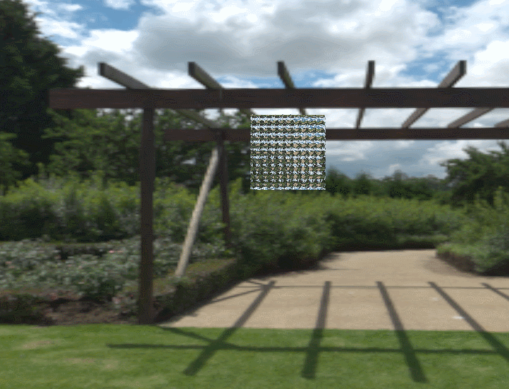

# Homework 9 Fluid SPH 流体模拟
###### 85 夏子汐 PB22000057

## 一、算法概述

流体模拟本质是求解Navis-Stokes方程：

$$
\begin{aligned}
\rho \frac{D \mathbf{v}}{D t} & =\rho g-\nabla p+\mu \nabla^2 \mathbf{v}  \\
\nabla \cdot \mathbf{v} & =0 
\end{aligned}
$$

时间离散求解通常会进行“算子分裂”步骤，进行两步的更新：

$$
\rho \frac{D \mathbf{v}}{D t} =\rho g+\mu \nabla^2 \mathbf{v}
$$
和
$$
\rho \frac{D \mathbf{v}}{D t} = -\nabla p
$$
计算密度：考虑一个粒子对密度的贡献，质点假设下为Dirac-$\delta$函数，$m\delta^3(\vec x)$，因为$\int\rho(\vec x)d^3\vec x=m$。

由于$\delta$函数不是良好定义的，可以使用其他“中心”函数代替，使用简单的多项式函数：

$$
\begin{aligned}
& W(r, h)=\sigma_d \begin{cases}6\left(q^3-q^2\right)+1 & \text { for } 0 \leq q \leq \frac{1}{2} \\
2(1-q)^3 & \text { for } \frac{1}{2} \leq q \leq 1 \\
0 & \text { otherwise }\end{cases} \\
& \text {其中 } q=\frac{1}{h}\|r\|, \sigma_1=\frac{4}{3 h}, \sigma_2=\frac{40}{7 \pi h^2}, \sigma_3=\frac{8}{\pi h^3}
\end{aligned}
$$

得到密度计算公式：

$$
 \rho_i = \sum_{j+i} \left(\frac{m_j}{\rho_j} \right) m_j W(\mathbf{x}_ i - \mathbf{x}_ j, h) =  \sum_{j+i} m_j  W_{ij}
$$

其中$j$的选取不需要全部其他粒子，可以只选择附近$h$距离的点，这是通过空间加速提升效率的。

## 二、WCSPH

使用压强计算公式计算：

$$
p_i =k_1 \left( \left(\frac{\rho_i}{\rho_0} \right)^{k_2} -1 \right)
$$

可以得到结果，效果如下：

### 2.1 粒子数的影响

固定`gravity=-9.8`，`viscosity=0.03`，`stiffness=500`，`exponent=7`，`dt=0.005`。

调整不同的单方向粒子数$n$（三个坐标轴保持相同），给出图像：

| $n=10$                 | $n=15$                 | $n=20$                 |
| ---------------------- | ---------------------- | ---------------------- |
|  |  |  |
| 单帧用时$3ms$          | $20ms$                 | $90ms$                 |

> 凝聚态物理的主要理念之一是"More is different"，即由大量原子分子组成的系统与原子分子本身之间会出现不同之处（例如导热、导电、力学性质各种性质），这是研究单个或者几个原子分子所不能体现出来的。

可以看到$n$太小是不能模拟出正确合理的结果的，但是$n$越大计算也就越慢。

### 2.2 模拟时间的影响

之后固定$n=15$以在能够体现物理现象的前提下保证效率，其他参数相同。现在修改模拟时间，给出图像：

| $dt=0.001$             | $dt=0.01$              | $dt=0.05$              |
| ---------------------- | ---------------------- | ---------------------- |
|  |  |  |

- 模拟时间增加到一定尺度，会导致“爆炸”，即粒子突然四处飘散，这可能是因为某个时刻某点压强太大，直接把旁边的粒子打到“远处”；

- 对比$dt=0.001$和$dt=0.005$（见2.1）可以看到细微的不同，其中有一个就是溅起水花的时机和幅度，$dt=0.005$会更大；

> 很多时候并不是像图中那么容易溅起水花，主要是水的表面张力起到了束缚作用。表面张力沿着表面方向，根据物理规律，表面张力做功$W=\sigma\cdot S$，与面积成正比，所以说**表面张力是阻止物体表面积增大的一种力**。
>
> 表面张力本质上是因为表面处分子间距较大，形成吸引作用力合力不为零，如图所示。如果能够通过计算每个粒子受力来控制运动，应该可以在模拟压强的同时模拟表面张力。本作业没有考虑相关因素。
>
> 

### 2.3 粘滞力的影响

| `viscosity=0`             | `viscosity=0.01`              | `viscosity=0.1`              | `viscosity=1`              |
| ---------------------- | ---------------------- | ---------------------- | ---------------------- |
|  |  |  |  |

增加粘滞力可以防止流体的形变，包括形成水花和向底部的扩散，对比两个极端更加明显。当然，最后一个是发生了爆炸现象。

### 2.4 劲度系数的影响

| `stiffness=0`             | `stiffness=100`              | `stiffness=10000`              | `stiffness=10^6`              |
| ---------------------- | ---------------------- | ---------------------- | ---------------------- |
|  |  |  |  |

劲度系数反应了抵抗压缩的能力，当劲度系数过大时，可以看到出现了爆炸现象。

### 2.5 指数的影响

| `exponent=1`             | `exponent=5`              | `exponent=10`              |
| ---------------------- | ---------------------- | ---------------------- |
|  |  |  |

当指数在合理范围内时可以给出正确的结果。指数在一定程度上反应了物体抵抗压缩的敏感程度。

### 2.6 例子：极端粘稠不可压缩液体

取`viscosity=1`，`stiffness=10^5`，`exponen=50`，效果如图：

但是刚开始液体下落时仍然会发生一定的体积压缩！

## 三、IISPH

通过隐式方法求解压强以尝试获得更好的稳定性的方法。本作业并没有完美实现，存在模拟过程中闪退的Bug（没时间调试了），而且效率不如上面的。

### 3.1 迭代次数的影响

设置`omega=5`，调整迭代次数$k$，可以看到迭代次数对看起来的结果影响不大，但是效率与其几乎正相关

| $k=2$                 | $k=5$                 | $k=10$                 |
| ---------------------- | ---------------------- | ---------------------- |
|  |  |  |
| 单帧用时$80ms$          | $120ms$                 | $220ms$                 |

最后看到的一些场景就是闪退的结果（在VS里面启动的话会有错误提示）。

### 3.2 `omega`的影响

设置$k=2$，调整`omega`，可以看到效果基本相同，出现闪退的时机也基本相同。

| `omega=0.1`                 | `omega=0.3`                 | `omega=0.9`                 |
| ---------------------- | ---------------------- | ---------------------- |
|  |  |  |

闪退bug在VS中的体现是`0xC0000005: 读取位置 0x00007FF1A7643200 时发生访问冲突。`我认为这是因为有两个粒子非常接近导致压强、密度很大，部分粒子越界；或者导致$a_{ii}=0$的问题。

