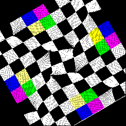
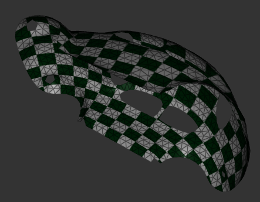

# Overview of My Course Study of Computer Graphics
###### Zixi Xia, teacher: Ligang Liu

##### Tips: To see the .gif animated pictures, please click [https://github.com/bob-xia/USTC_CG_24_Zixi-Xia_Reports/blob/main/brief_intro.md](https://github.com/bob-xia/USTC_CG_24_Zixi-Xia_Reports/blob/main/brief_intro.md).

## Selected Homeworks

### Hw2: Image Warping

- Two types of interpolation function: IDW (Inverse distance-weighted) and RBF (Radial basis functions);
- Method to fill the black seams: reversed transform, average number.

| Method            | Control Points         | IDW  | RBF-1 | RBF-2 |
| ----------------- | ---------------------- | ---- | ----- | ----- |
| No filling        |  |  | ||
| Reverse Transform |  |  | ||

### Hw3: Poisson Image Editing [Perez et al., Siggraph 2003]

- Seamless image cloning by solving Poisson Equation;
- Two major types of algorithm: Seamless and Mixed.

|            Seamless            |             Mixed              |
| :----------------------------: | :----------------------------: |
|  |  |

### Hw4: Tutte Parameterization

- Minimal Surface: different weight-uniform weights, cotangent weights, Floater's shape-preserving weights;
- Parameterization: minimal surface, where the boundary are set to a plane.

|                        |                  Uniform weights                   |                 Cotangent weights                  |              Shape-preserving weights              |
| :--------------------: | :------------------------------------------------: | :------------------------------------------------: | :------------------------------------------------: |
| map boundary to circle |  |  |  |
| map boundary to square |  |  |  |

|        |                  Uniform weights                  |                 Cotangent weights                 |             Shape-preserving weights              |
| :----: | :-----------------------------------------------: | :-----------------------------------------------: | :-----------------------------------------------: |
| Circle |  |  |  |
| Square |  |  |  |

### Hw5: ARAP Parameterization [Liu et al., Siggraph 2008]

- The relationship between texture coordination and its current position came up to two types: ARAP (As-rigid-as-possible) and ASAP (As-similar-as-possible).
- Solve nonlinear equations by Local/Global Approach.

|                 |                       ARAP                        |                   ARAP-filling                    |                       ASAP                        |                   ASAP-filling                    |
| :-------------: | :-----------------------------------------------: | :-----------------------------------------------: | :-----------------------------------------------: | :-----------------------------------------------: |
|  `Balls.usda`   |  |  |  |  |
| `Cow_dABF.usda` |  |  |  |  |

|                     |          ARAP          |                    ARAP-filling                    |          ASAP          |      ASAP-filling      |
| :-----------------: | :--------------------: | :------------------------------------------------: | :--------------------: | :--------------------: |
| `Gargoyle_ABF.usda` |  |                              |  |  |
|  `Isis_dABF.usda`   |  |  |  |  |

### Hw6: Shader Programming

- Realization of Blinn-Phong lighting model, as well as normal map, and gamma correlation. 

	| Normal by Interpolation | Normal Map             |
	| ----------------------- | ---------------------- |
	|   |  |

- Realization of Shadow Mapping, and soften the edge of shadow.

	|  |  |
	| :--: | ---- |
	|   |  |

### Hw8: Mass Spring Model

- Mass-Spring Model with realization of Euler equation (explicit, implicit, semi-implicit);
- Fast simulation method of Mass-Spring model [Liu et al., Siggraph 2008].

| Different Mesh Density: 10x10 | 20x20                  | 40x40                  |
| ----------------------------- | ---------------------- | ---------------------- |
|         |  |  |

| Fixed points: A vertex of the square | Diagonal vertices of the square | Four vertices of the square |
| ------------------------------------ | ------------------------------- | --------------------------- |
|                |           |       |

| External force $a_w=10r=10||X_i||$ | External force $a_w=\cfrac{-(X_i-X_0)}{||X_i-X_0||^3}$，where $X_0=(0,0,-2)$ |
| ---------------------------------- | ------------------------------------------------------------ |
|              |                                        |

| Penalty Force method for collision | Optimized method       | Example: collision between two balls |
| ---------------------------------- | ---------------------- | ------------------------------------ |
|              |  |                |

### Hw9: SPH fluid

- Solving Navier-Stokes equation by Operator Splitting, as well as getting physical quantities from neighboring particles, called WCSPH.
- Realization of incompressible fluid, which is called IISPH.

|                      WCSPH                       |                      IISPH                       |
| :----------------------------------------------: | :----------------------------------------------: |
|  |  |

## Final Project

### Simulation of visual effect with Einstein's Special Theory of Relativity, Author: Yutian Zhu, Zichao Liu, Zixi Xia

#### Results and Report

##### See [https://github.com/bob-xia/USTC_CG_24_Zixi-Xia_Reports/tree/main/project](https://github.com/bob-xia/USTC_CG_24_Zixi-Xia_Reports/tree/main/project) for seven video tapes and report (Chinese version and English version translated by ChatGPT).

